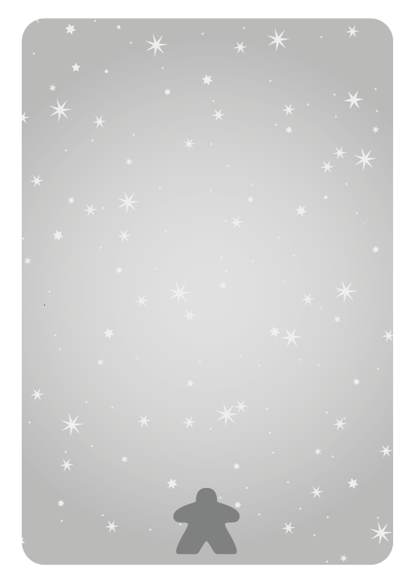
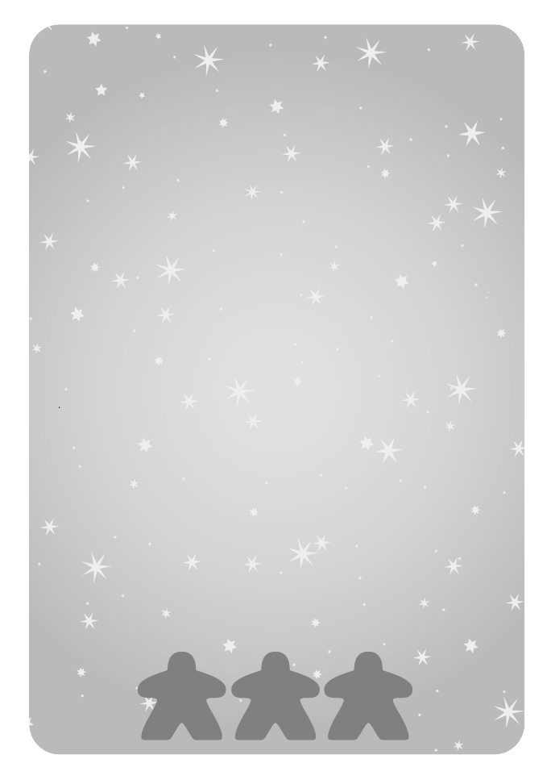
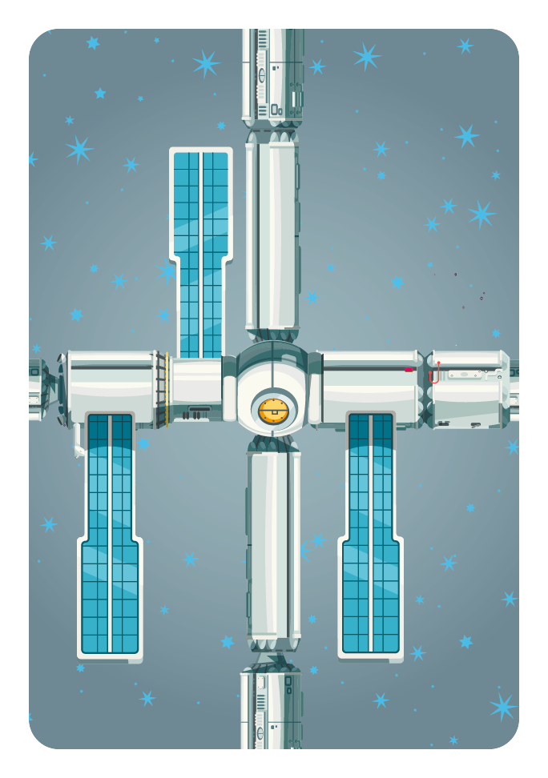

# Outpost Seven

**By Stefan Alexander**
*2 players / 30 min / 12+ years*

## Game Overview

After a long voyage from Earth, you and your crew arrive at a space station, ready for some well-earned rest. Instead, you find the station destroyed, with broken space station modules floating in orbit. Thankfully, you’re a salvage crew!

Each round, you will **salvage** space station modules (picking up new cards) or **repair** the modules (playing cards into the 5x5 grid in the middle of the table). You will place repair cubes on your modules to show how much they have been repaired.

Each row and column in the space station has its own population, which will vote for the player who has the most repair cubes in that row or column. Once all the modules have been played, the player with the most population tokens voting in their favor becomes the new station commander and wins the game.

## Components

*(Inferred from assets)*
-   **Module Cards** (Blue, Green, Yellow)
-   **Population Cards**
-   **Vote Tokens** (Red, Yellow)
-   **Repair Cubes**
-   **Reference Cards**

## Setup

1.  Each player chooses a color (Red or Yellow) and takes the cubes and reference cards in their color.
2.  **Population Grid**: Shuffle the 15 population cards and turn over ten of them to form the 5x5 grid where you will build the station. Put the unused population cards back in the box.
3.  **Population Tokens**: Put 1-3 population tokens on each population card, based on whether it has 1-3 population icons on it.
4.  **Vote Tokens**: Place a vote token on each starting card - alternate them red and yellow.
5.  **Module Deck**: Shuffle the deck of module cards.
    a.  Deal 7 cards to each player - this is your hand of cards. Put the rest of the deck face-down next to the grid.
    b.  Discard the top 10 cards from the deck, placing them next to the deck to form a discard pile.
    c.  Turn the top 5 cards from the deck face-up next to the deck.
    d.  **Starting Hands**: Choose a starting player. From the 7 they were dealt, the starting player keeps cards totaling **12**, discarding the others. The second player keeps cards totaling **16**, discarding the rest.

> **Tip**: For your first game, don’t worry about which specific cards to keep, just keep any combination of cards totaling 12 or 16.

<table>
  <tr>
    <td style="border: none;"></td>
    <td></td>
    <td></td>
    <td></td>
    <td></td>
    <td></td>
  </tr>
  <tr>
    <td></td>
    <td style="background-color: #f0f0f0;"></td>
    <td style="background-color: #f0f0f0;"></td>
    <td style="background-color: #f0f0f0;"></td>
    <td style="background-color: #f0f0f0;"></td>
    <td style="background-color: #f0f0f0;"></td>
  </tr>
  <tr>
    <td></td>
    <td style="background-color: #f0f0f0;"></td>
    <td style="background-color: #f0f0f0;"></td>
    <td style="background-color: #f0f0f0;"></td>
    <td style="background-color: #f0f0f0;"></td>
    <td style="background-color: #f0f0f0;"></td>
  </tr>
  <tr>
    <td></td>
    <td style="background-color: #f0f0f0;"></td>
    <td style="background-color: #f0f0f0;"></td>
    <td style="background-color: #f0f0f0;"></td>
    <td style="background-color: #f0f0f0;"></td>
    <td style="background-color: #f0f0f0;"></td>
  </tr>
  <tr>
    <td></td>
    <td style="background-color: #f0f0f0;"></td>
    <td style="background-color: #f0f0f0;"></td>
    <td style="background-color: #f0f0f0;"></td>
    <td style="background-color: #f0f0f0;"></td>
    <td style="background-color: #f0f0f0;"></td>
  </tr>
  <tr>
    <td></td>
    <td style="background-color: #f0f0f0;"></td>
    <td style="background-color: #f0f0f0;"></td>
    <td style="background-color: #f0f0f0;"></td>
    <td style="background-color: #f0f0f0;"></td>
    <td style="background-color: #f0f0f0;"></td>
  </tr>
</table>

## Gameplay

Players alternate taking turns. On your turn, you can **Salvage** or **Repair**.

When a player can’t play any more (because they can’t salvage or repair), they stop playing, and their opponent keeps taking turns until they can no longer play. Then the game ends.

### Salvage (Pick up module cards)

Pick up any combination of cards with a value totaling **12 or less** from the 5 face-up cards. You can’t have more than 7 cards in your hand.

After you’re done, turn over new cards from the deck so there are 5 face-up. If the deck runs out, continue playing.

### Repair (Play a module card)

There are four steps to playing a module card:
1.  Connect the module to the rest of the station.
2.  Place repair cubes on the module.
3.  Use bonuses.
4.  Check votes.

#### Step 1: Connect Module

Play one module card from your hand into the 5x5 grid.
-   The first card can be placed anywhere in the grid.
-   After that, cards must always be adjacent to another module card.
-   You can’t build outside the 5x5 grid defined by the starting cards.

**Cost**: To get the parts to repair the module enough to place it, you must **scrap** another module. Discard 1 other card from your hand of the **same number (or higher)**. Put the discard face-up in the discard pile.

#### Step 2: Place Repair Cubes

Place cubes on the card you just played to represent repairs.
-   Place **1 cube** if the module you discarded was the **same color**.
-   Place additional cubes if you **overpaid** (discarded a card higher than the value of the card you played). Example: Play a 4, discard a 5 of same color = 1 cube (color match) + 1 cube (overpay by 1) = 2 cubes.

-   Cubes are filled top to bottom on empty spaces.
-   When placing on a bonus space, place the cube on the left side.
-   If a card has no empty spaces, you can't place more cubes.

**Neutral Card**: If you discard a different-colored card of the same value, you place the card with **no cubes**. This is a neutral card. It can be taken over by an opponent but may be strategically useful.

#### Step 3: Use Bonuses

When you place repair cubes on **bonus spaces** (spaces with icons), you must take bonus actions immediately. You can use them in any order, but must use them this turn.
-   Slide the cube to the right once used to keep track.

**Bonus Types**:

1.  **Place Cube** 
    -   Place 1 cube on each of your cards and neutral cards in the **row and column**.
    -   Place on the highest unoccupied space.

2.  **Remove Cube** 
    -   Remove the lowest cube from each of your opponent’s cards in the **row and column**.
    -   Exception: If the lowest cube is on a bonus space, you can’t remove it.

3.  **Add Population** 
    -   Add 1 population to the row’s population card for each same-colored card in the row.
    -   Add 1 population to the column’s population card for each same-colored card in the column.
    -   *Example*: Activating a Green bonus adds population for every Green card in that row/column.

> **Note**: Bonuses are mandatory. Be careful not to increase population for a row/column your opponent will win!

#### Step 4: Check Votes

The population of a row or column votes for the player with the most repair cubes in that row or column.
-   Check rows/columns where you added/removed cubes.
-   If **Red** has more cubes -> flip tokens to Red.
-   If **Yellow** has more cubes -> flip tokens to Yellow.
-   Ties: Token stays on existing color.

## End of Game and Scoring

When a player cannot play (no more cards to draw AND cannot play a card), they pass. The opponent continues until they also cannot play.

**Scoring**:
-   Count the total population on cards with a vote token in your color.
-   The player with the most population voting for them wins!
-   **Tiebreaker**: Most cubes on the board.
