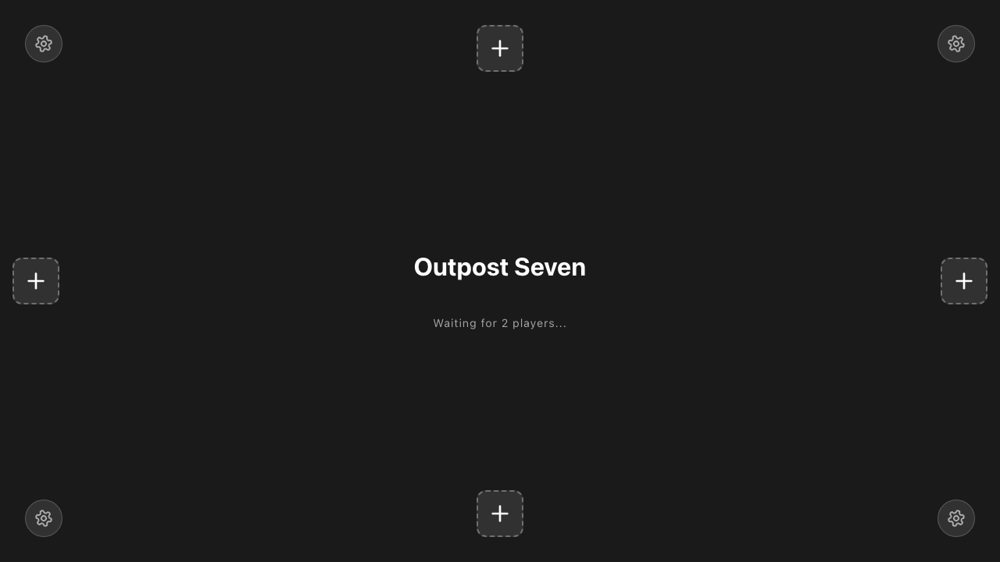
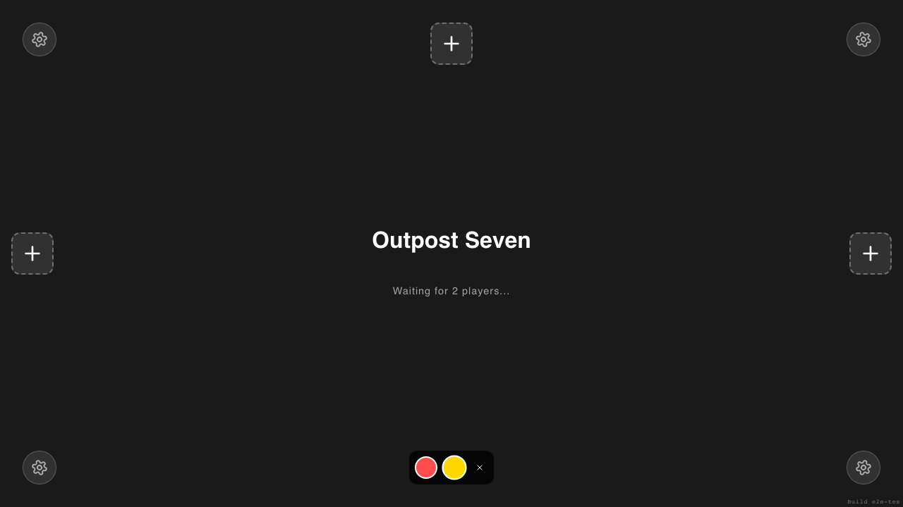
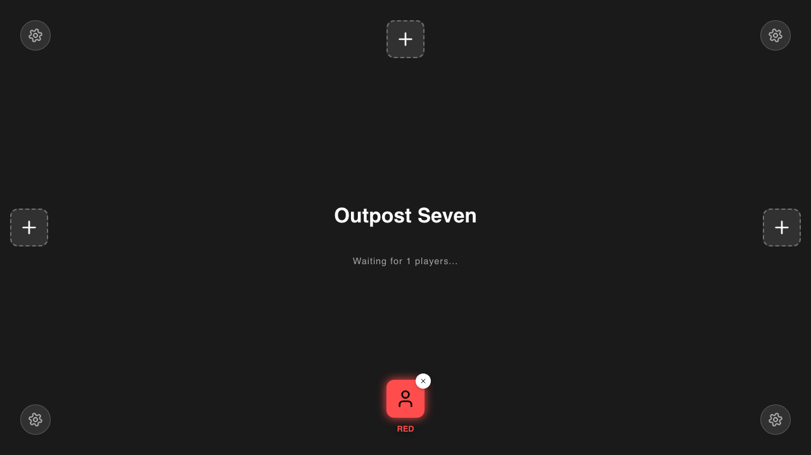
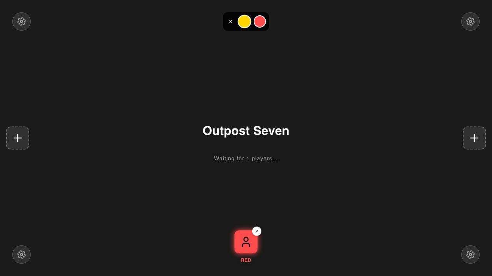
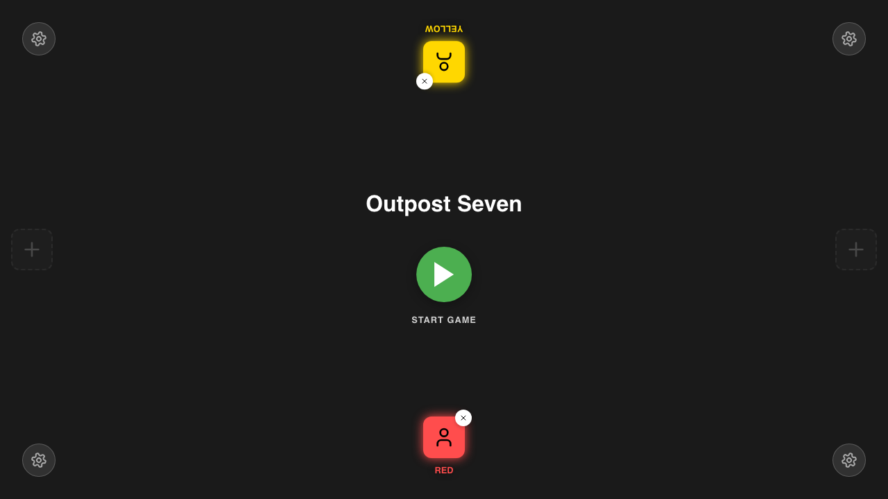
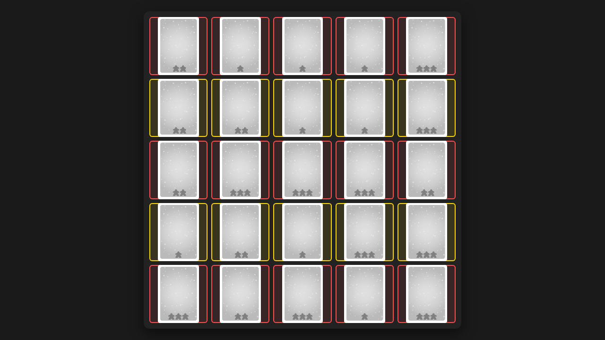

# Game Setup

**As a** player, **I want** to join the lobby and start the game, **so that** I can play.

## Lobby - Initial State

**Specs:**
- Lobby should display 4 edge controls
- Play button should be hidden or inactive initially
- The lobby identifies the exact E2E build without masking

## Lobby - Player 1 Choosing Color

**Specs:**
- Color picker should appear for bottom player

## Lobby - Player 1 Joined

**Specs:**
- Bottom player token should appear
- Bottom player should be Red

## Lobby - Player 2 Choosing Color

**Specs:**
- Color picker should appear for top player

## Lobby - Player 2 Joined

**Specs:**
- Top player token should appear
- Top player should be Yellow
- Play button should now be visible

## Game Board Started

**Specs:**
- Board container should be visible
- The tabletop identifies the exact E2E build without masking
- Board orientation should be 90°
- Should have 11 header cells (5 cols + 5 rows + 1 spacer)
- Should have 25 empty grid cells
- Headers should have population badges with counts
- Headers should alternate ownership (Red/Yellow meeple color)

