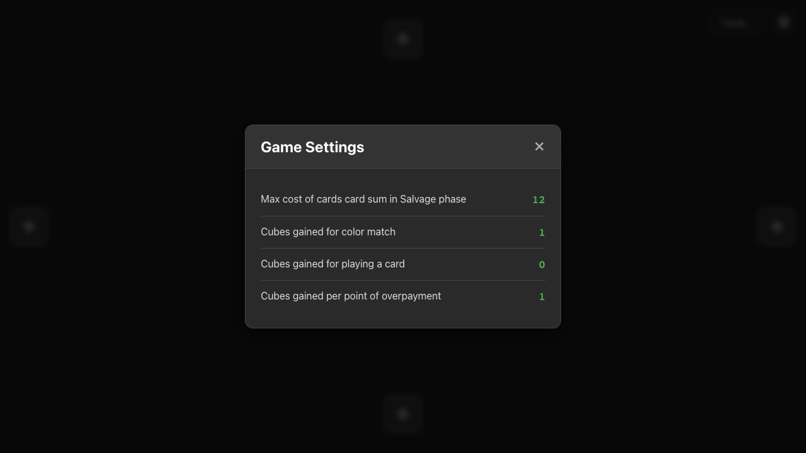
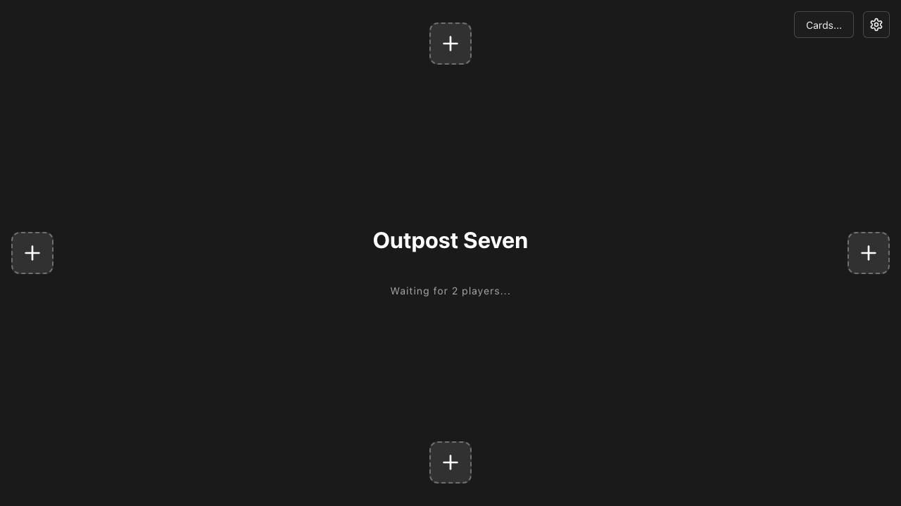
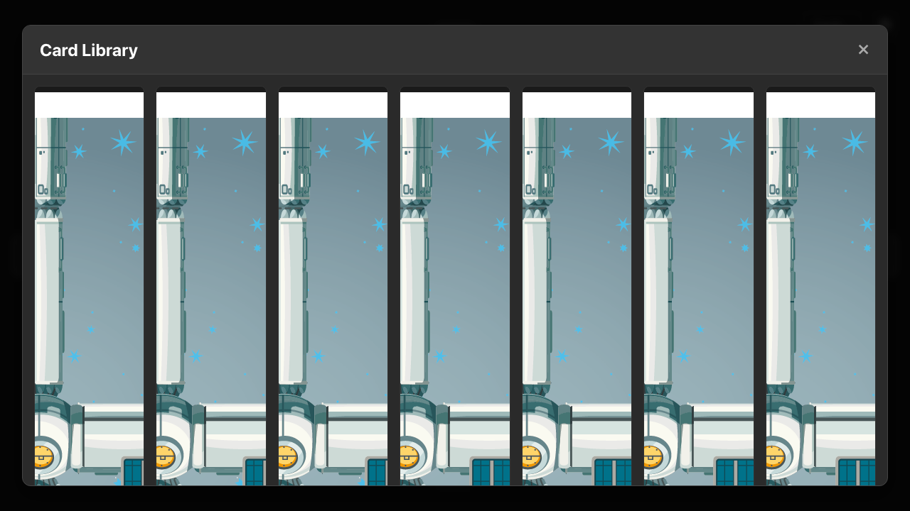

# Settings and Cards UI

**As a** player, **I want** to see game settings and the card library, **so that** I can reference rules and components.

## Main Screen with Global Controls

**Specs:**
- Settings button is visible
- Cards button is visible

## Settings Modal Open

**Specs:**
- Modal header is visible
- Settings values are displayed

## Main Screen after Closing Settings

**Specs:**
- Modal is hidden

## Cards Modal Open

**Specs:**
- Modal header is visible
- Card grid is populated

## Main Screen after Closing Cards

**Specs:**
- Modal is hidden

