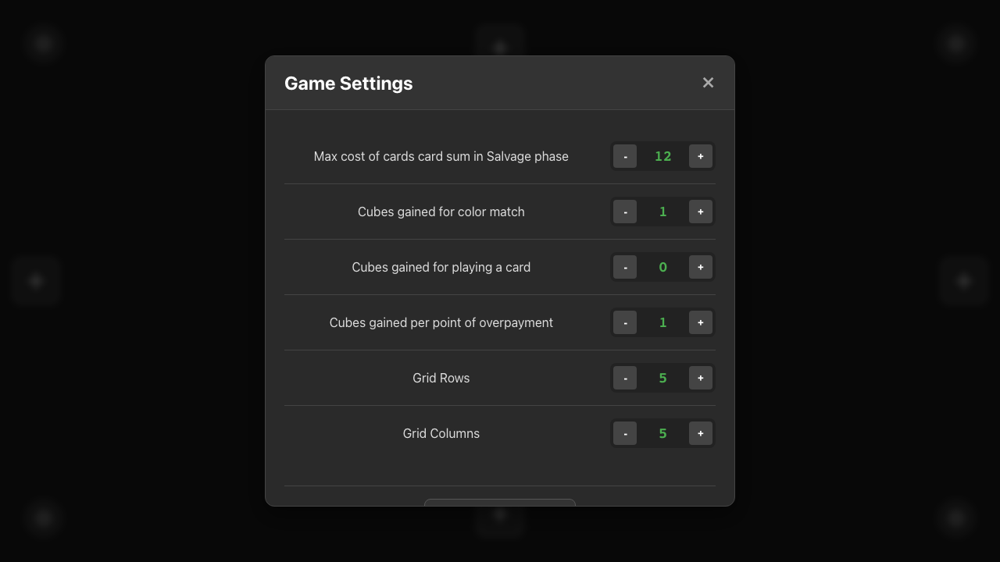
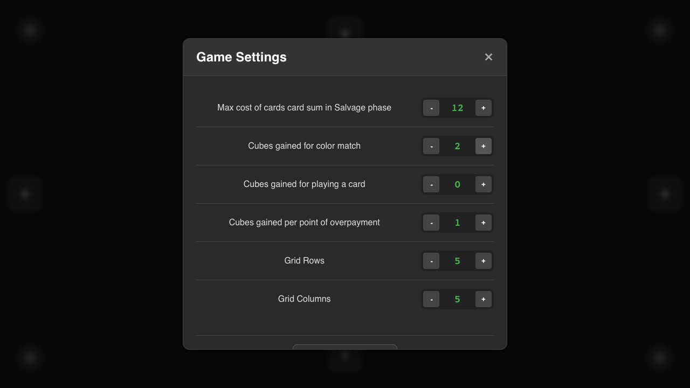
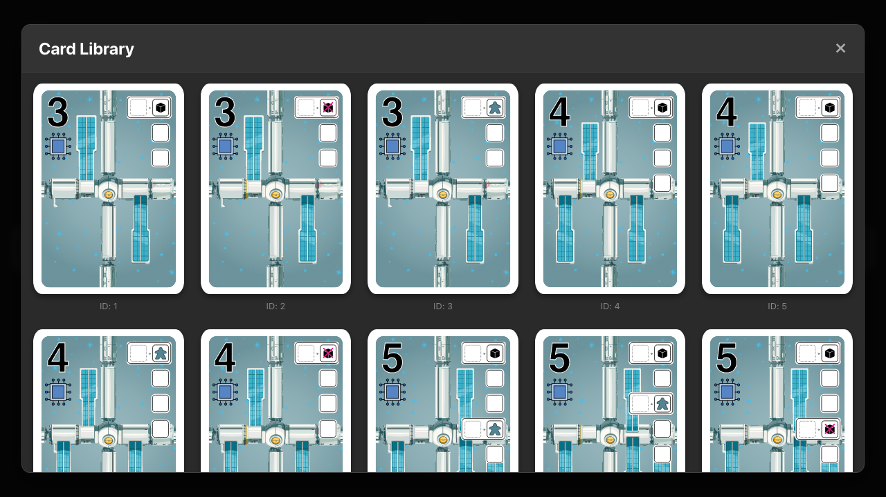
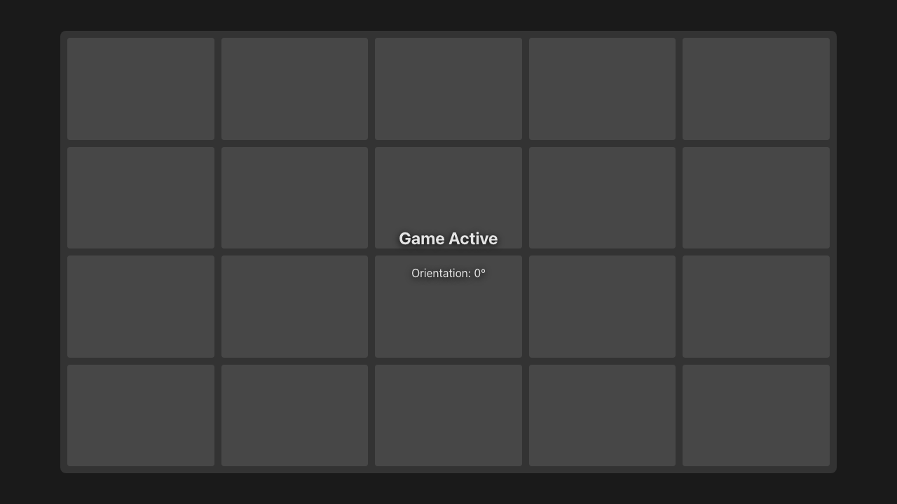

# Settings and Cards

Verify opening settings, editing values, and navigating to cards.

## Open Settings Modal

**Specs:**
- Clicking corner gear icon opens settings modal

## Edit Game Setting

**Specs:**
- Clicking + updates the setting value

## Navigate to Card Library

**Specs:**
- Clicking Open Card Library switches to Cards Modal

## Close Modals

**Specs:**
- Clicking close button dismisses modal

## Verify Grid Settings Apply to Board

**Specs:**
- Board grid cells reflect changed rows setting

