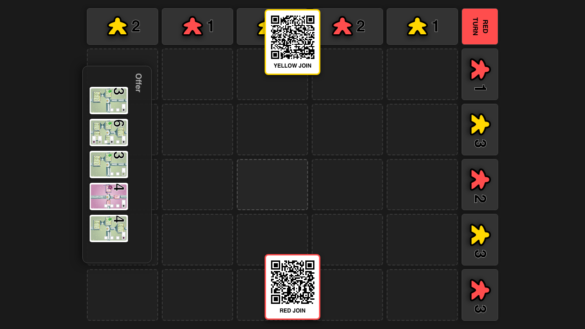
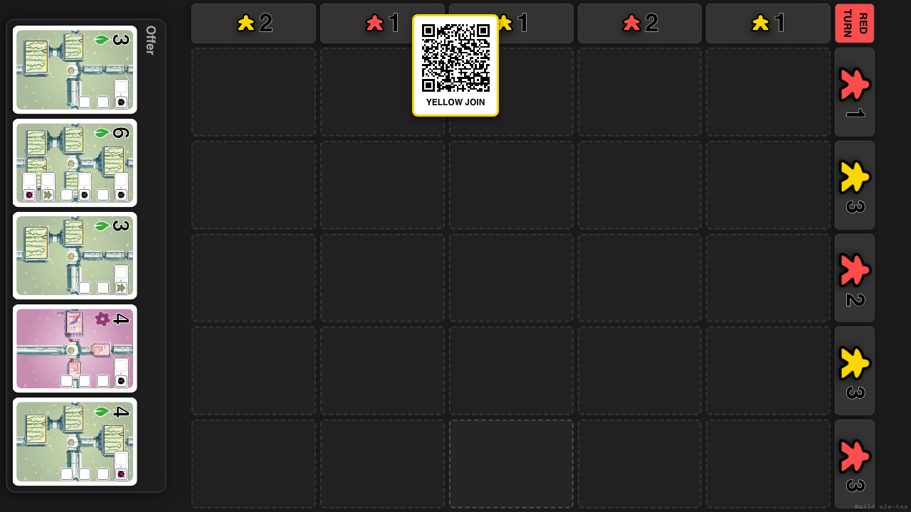
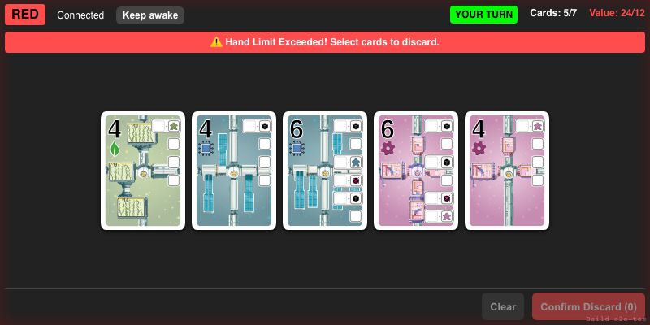
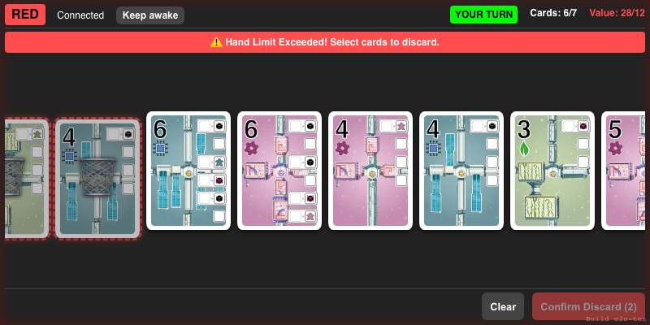
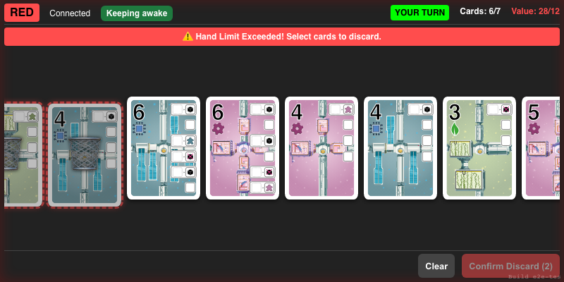
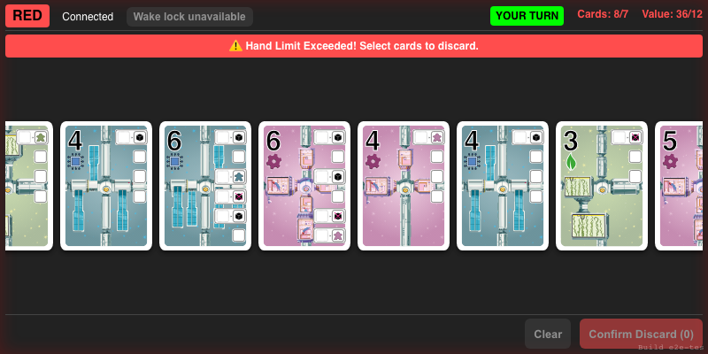

# Hand and Phone UI

Verify Firebase controller connection and hand syncing

## Navigate to game and start 2-player match

**Specs:**
- Open game page
- Configure and start game
- Verify board and QR codes visible

## Initiate connection

**Specs:**
- Click Red QR code and wait for popup

## Verify Red player connected (Client View)

**Specs:**
- Verify Red player connected

## Force hand limit and verify discard flow

**Specs:**
- Force draw to exceed limit
- Select and discard cards

## Keep the connected private hand awake

**Specs:**
- Wake lock is opt-in and reports when it is active
- Wake lock releases while hidden and returns when the hand is visible again

## Continue normally when wake lock is unavailable

**Specs:**
- Unsupported browsers show a disabled fallback without disrupting the hand

