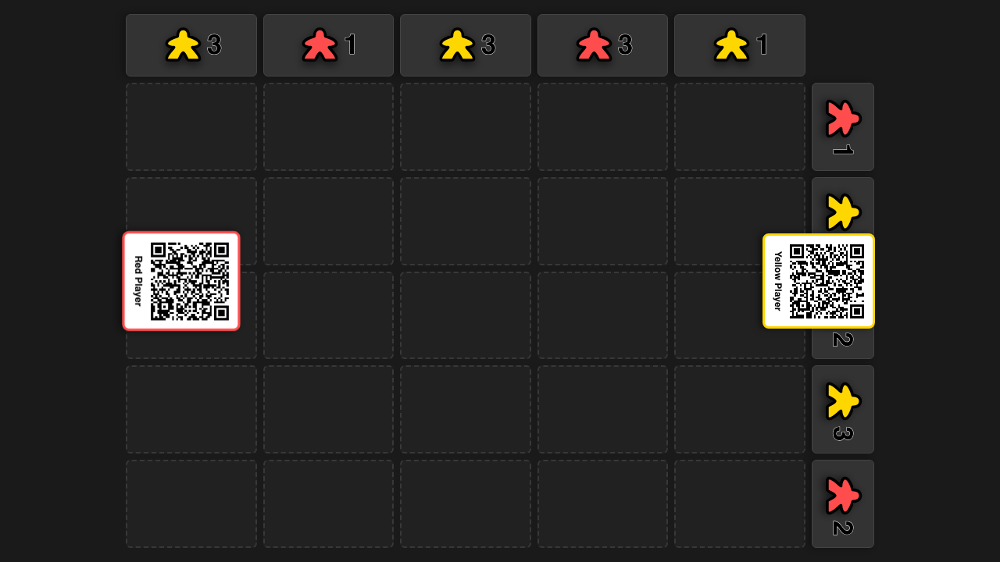

# Hand and Phone UI

Verify peer connection and hand syncing

## Navigate to game and start 2-player match

**Specs:**
- Open game page
- Configure and start game
- Verify board and QR codes visible

## Connect Red player via QR code

**Specs:**
- Click Red QR code and wait for popup
- Verify Red player connected

