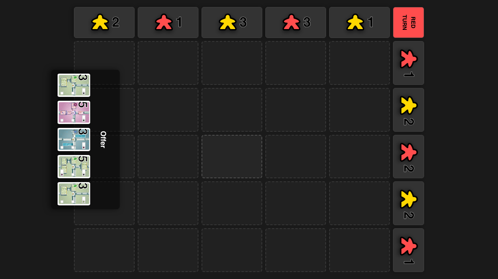
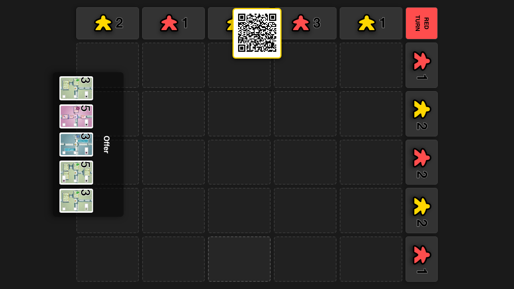
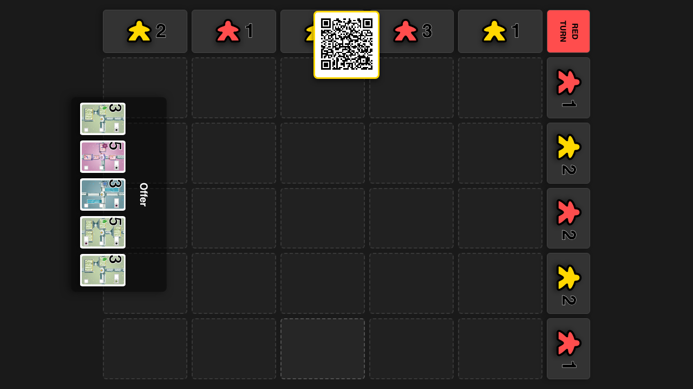
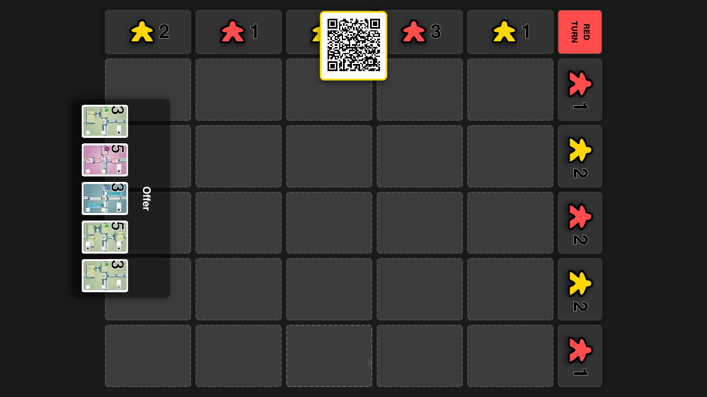
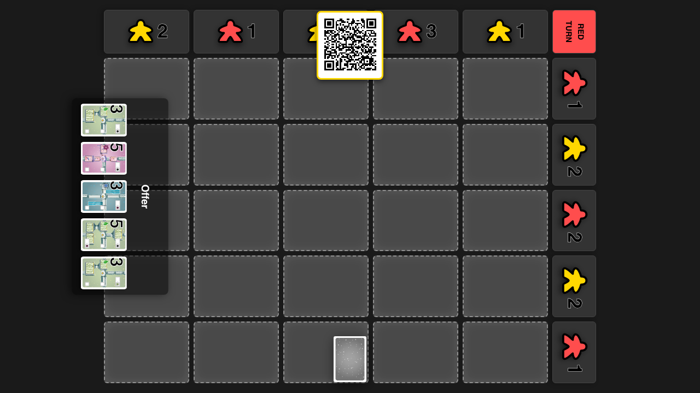
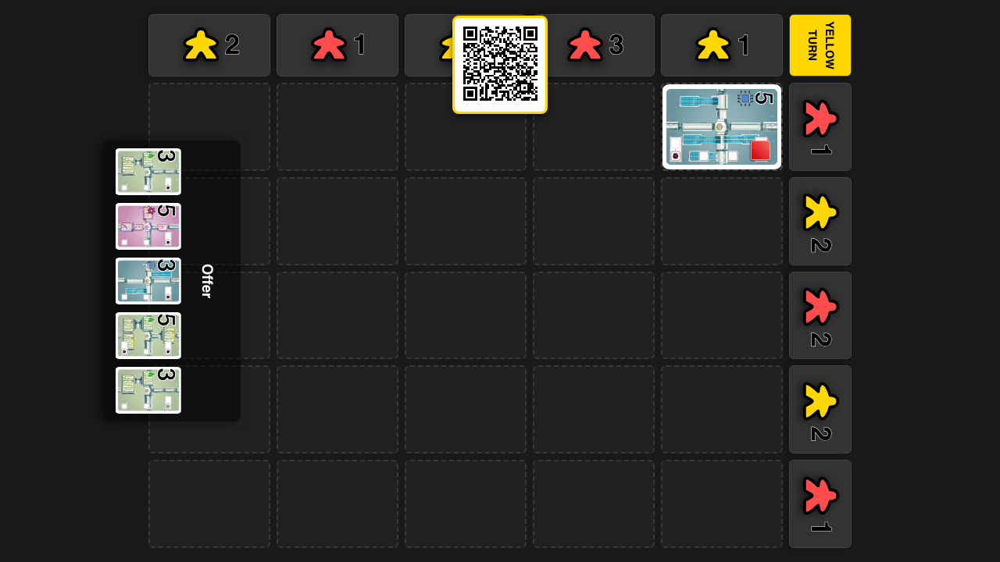

# Gameplay Loop

Verify full gameplay cycle: Selection -> Visuals -> Placement

## Start Game with Red Player

**Specs:**
- Add Red Player and Start

## Connect Red Player via QR

**Specs:**
- Open Red Client

## Red Player Discards if Over Limit

**Specs:**
- Discard down to limit

## Red Player Selects Play and Pay Cards

**Specs:**
- Select Valid Play/Pay Pair

## Verify Face Down Card and Highlights

**Specs:**
- Face down card visible at bottom
- Valid cells highlighted

## Click cell to place card

**Specs:**
- Click target cell (0,0)
- Wait for animation and placement

