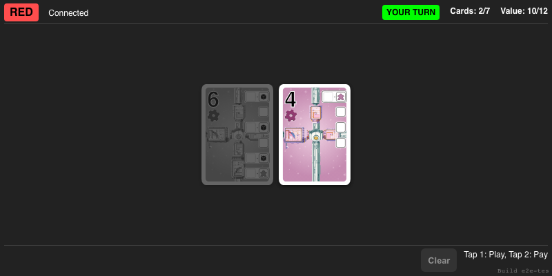
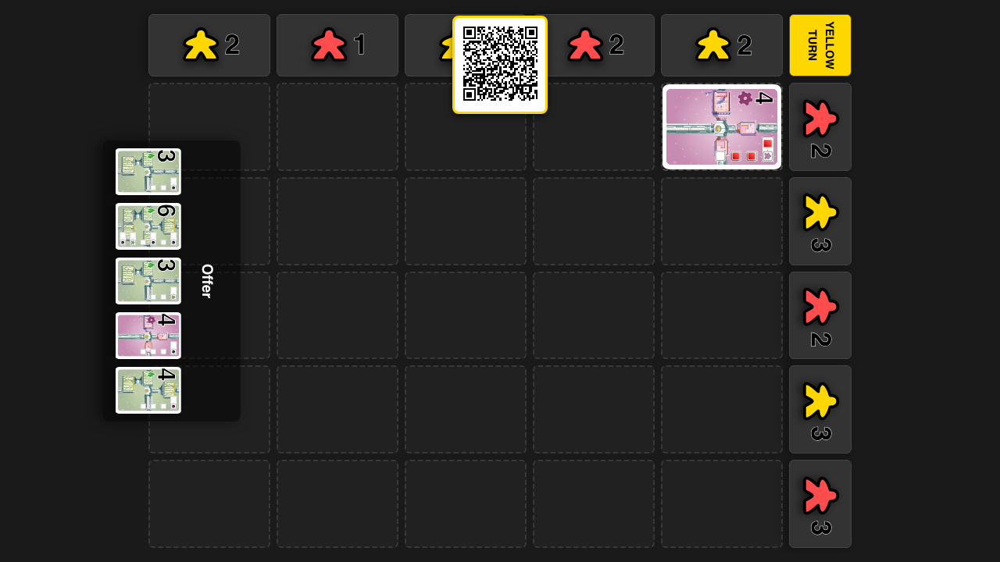
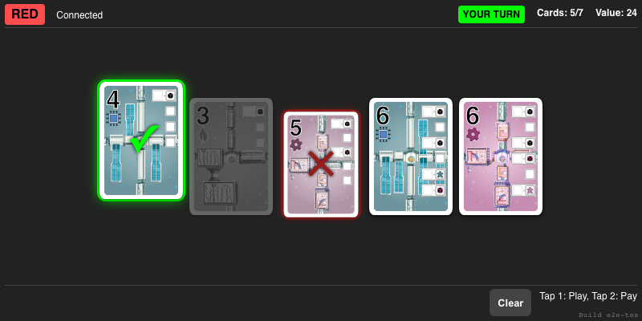
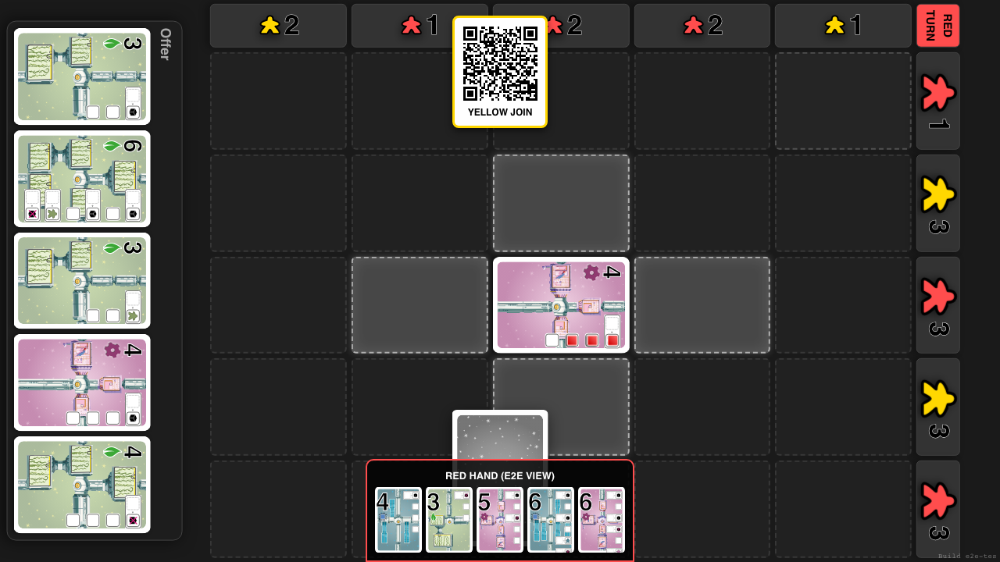
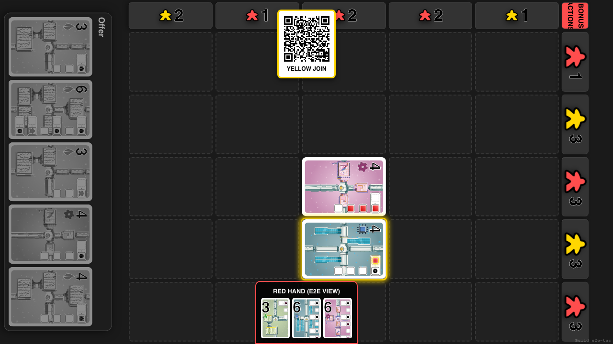

# Gameplay Loop

Verify full gameplay cycle: Selection -> Visuals -> Placement -> Interactive Bonus

## Start Game with Red Player

**Specs:**
- Add Red Player and Start

## Connect Red Player via QR

**Specs:**
- Open Red Client

## Red Player Discards if Over Limit

**Specs:**
- Discard down to limit

## Red Player Selects Play and Pay Cards

**Specs:**
- Select Valid Play/Pay pair

## Verify Face Down Card and Highlights

**Specs:**
- Face down card visible at bottom
- Every cell is a legal first placement with a static glow

## Click cell to place card

**Specs:**
- Click target cell (2,2)
- Wait for animation and placement
- Public deck, discard, and hand counts update after the repair

## Resolve Bonus Phase if Active

**Specs:**
- Check and Resolve Bonus
- Verify Final Turn State (Yellow)

## Red selects cards for the next repair

**Specs:**
- Select a legal play and payment pair
- Unavailable cards are dimmed without losing their colour

## Only spaces next to the station are legal

**Specs:**
- Only the four orthogonally adjacent cells have a static glow
- A distant or diagonal space rejects the card

## A card can be placed next to the station

**Specs:**
- An adjacent space accepts the card
