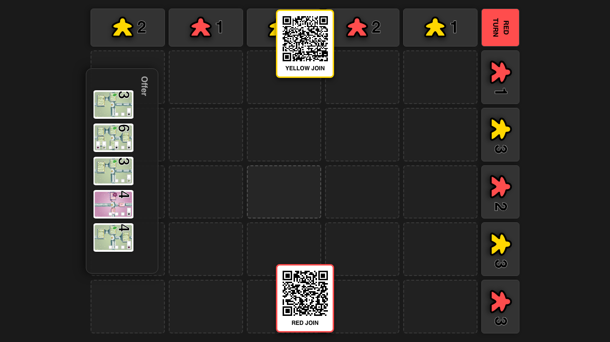
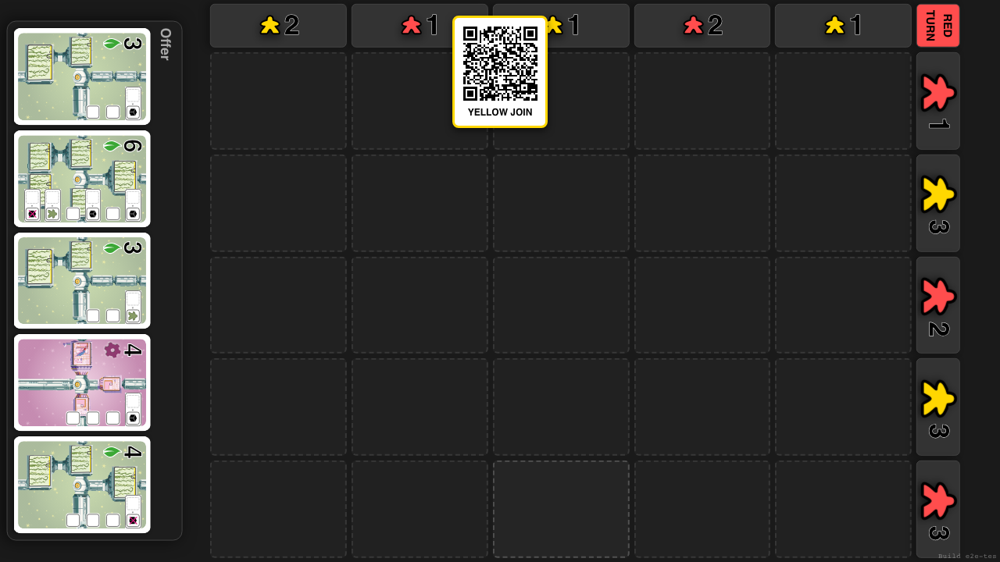
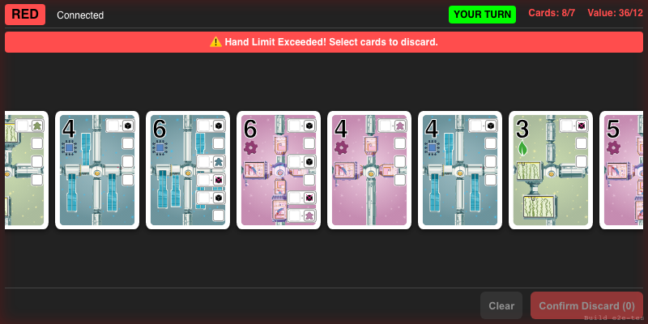
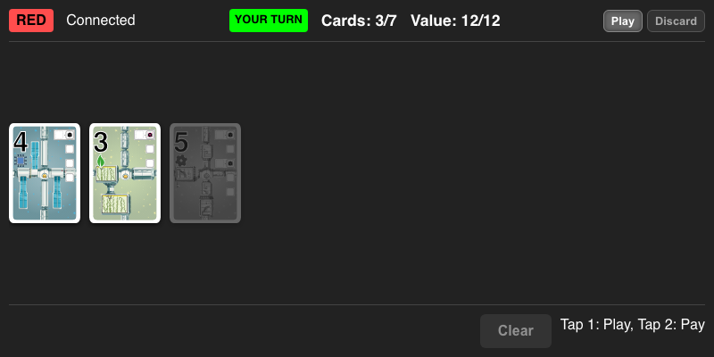
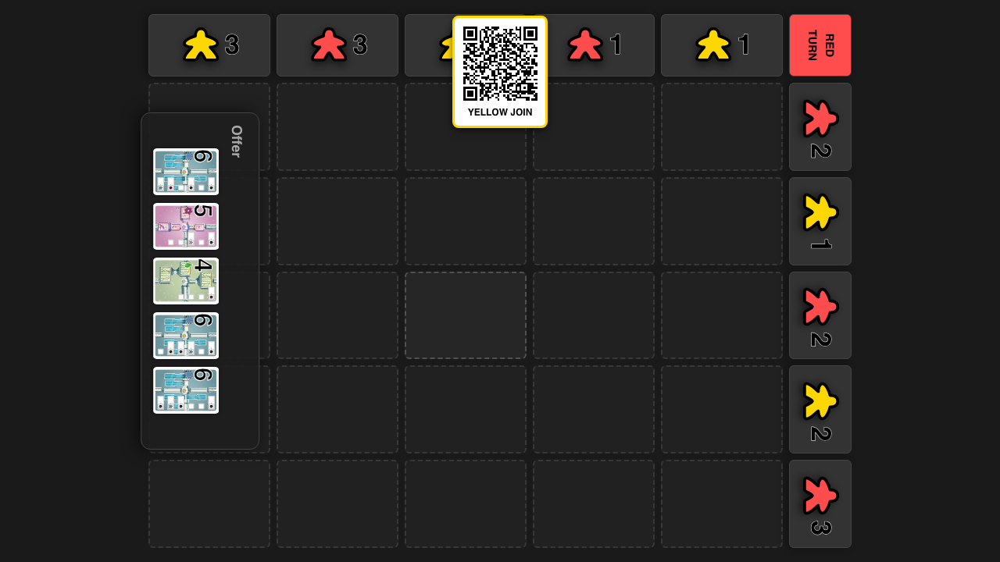
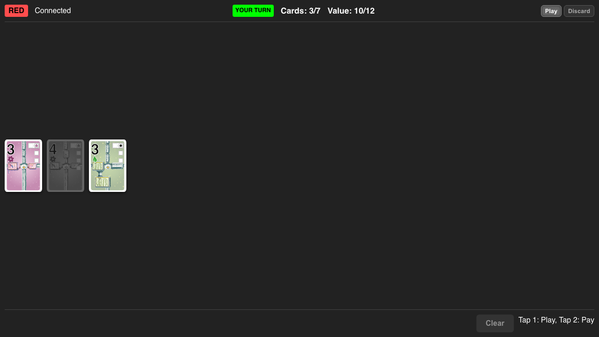

# Discard Flow

Verify player can discard when over hand limit

## Start Game

**Specs:**
- Start Game

## Connect Red Player

**Specs:**
- Connect Red

## Deal Cards to Exceed Limit

**Specs:**
- Force Deal to 8 Cards

## Select and Discard Cards

**Specs:**
- Select and Confirm Discard

## Start a game and immediately connect the red player

**Specs:**
- Red receives the five-card opening hand

## Discard the over-limit cards and receive the updated hand

**Specs:**
- Host and player both contain the same three remaining cards

