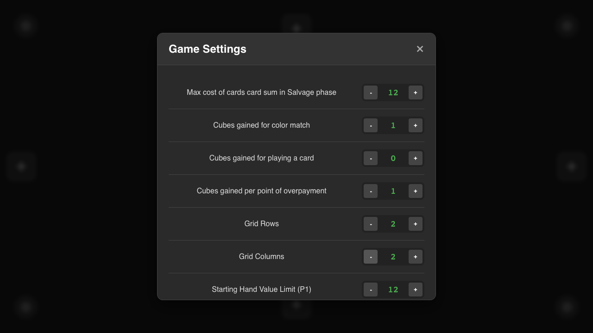
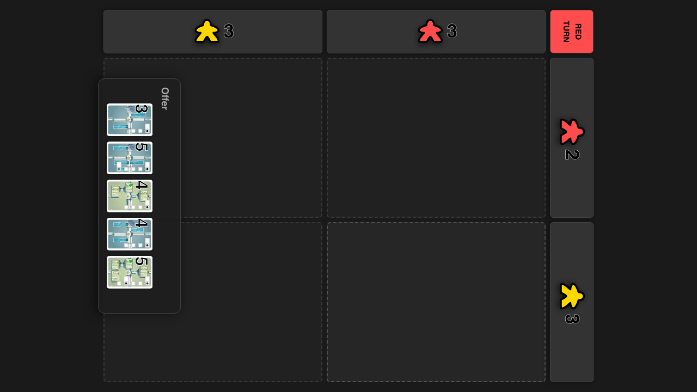
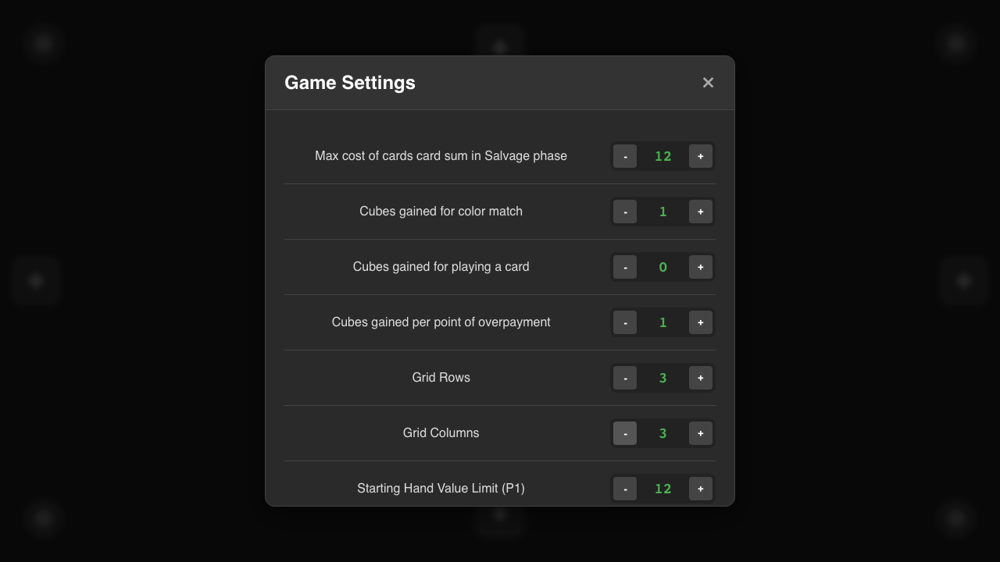
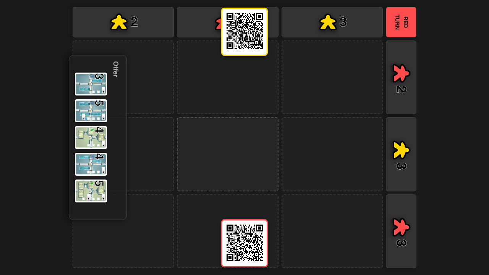
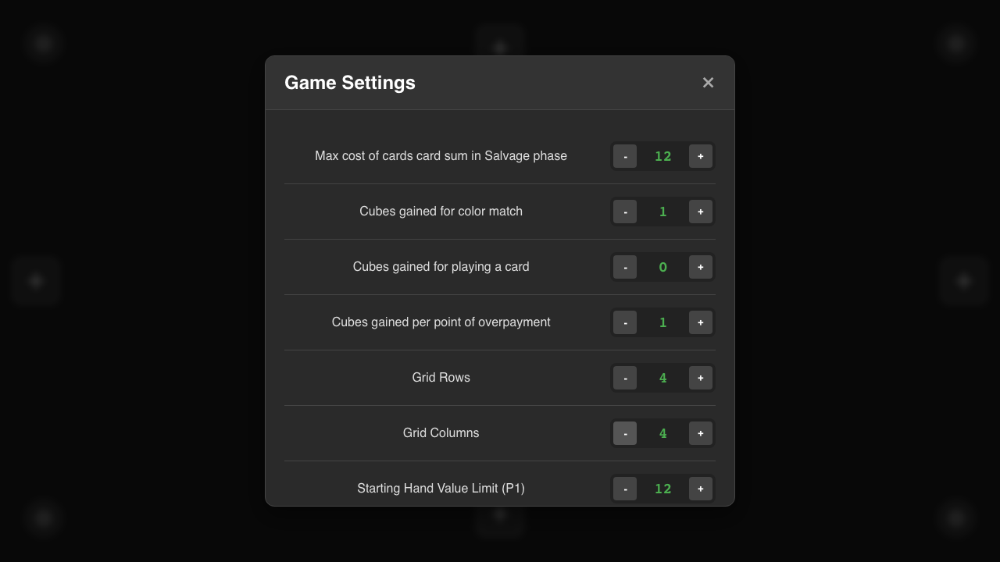
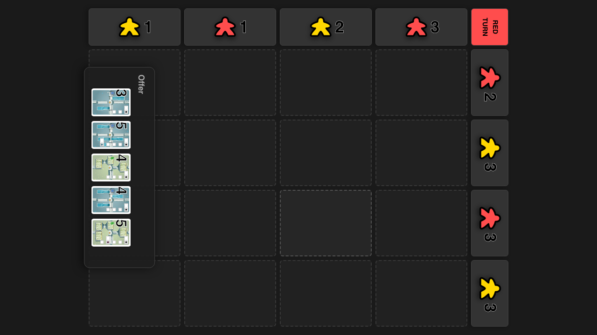
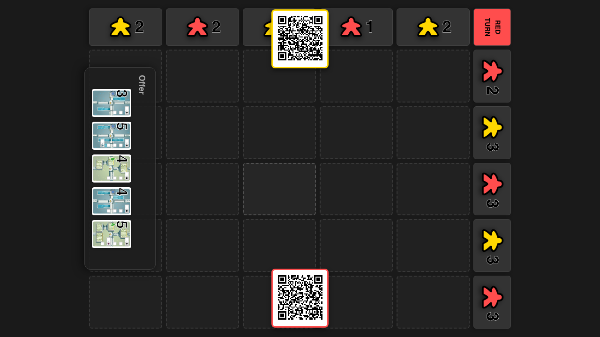

# Grid Size Initialization

**As a** player, **I want** the game board to correctly reflect the configured grid size, **so that** I can play on different board sizes.

## Load Game for 2x2 Test

**Specs:**
- Lobby is visible

## Update Settings to 2x2

**Specs:**
- Rows set to 2
- Cols set to 2

## Verify 2x2 Board Layout

**Specs:**
- Board container is visible
- Correct number of cells (4)
- Correct number of column headers (2)
- Correct number of row headers (2)

## Load Game for 3x3 Test

**Specs:**
- Lobby is visible

## Update Settings to 3x3

**Specs:**
- Rows set to 3
- Cols set to 3

## Verify 3x3 Board Layout

**Specs:**
- Board container is visible
- Correct number of cells (9)
- Correct number of column headers (3)
- Correct number of row headers (3)

## Load Game for 4x4 Test

**Specs:**
- Lobby is visible

## Update Settings to 4x4

**Specs:**
- Rows set to 4
- Cols set to 4

## Verify 4x4 Board Layout

**Specs:**
- Board container is visible
- Correct number of cells (16)
- Correct number of column headers (4)
- Correct number of row headers (4)

## Load Game for 5x5 Test

**Specs:**
- Lobby is visible

## Update Settings to 5x5

**Specs:**
- Rows set to 5
- Cols set to 5

## Verify 5x5 Board Layout

**Specs:**
- Board container is visible
- Correct number of cells (25)
- Correct number of column headers (5)
- Correct number of row headers (5)

