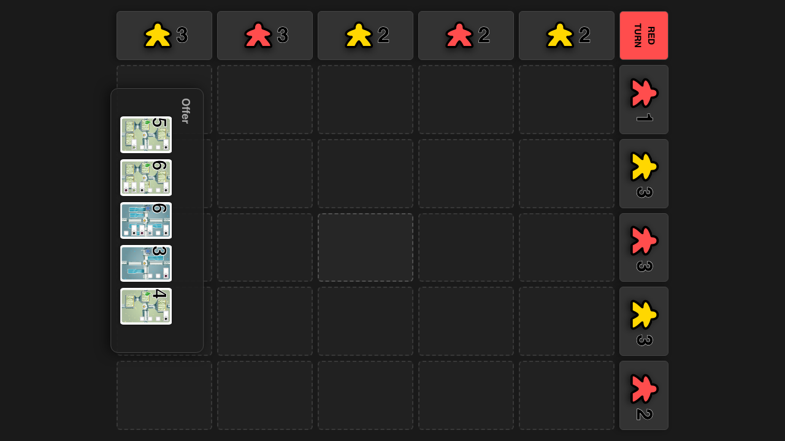
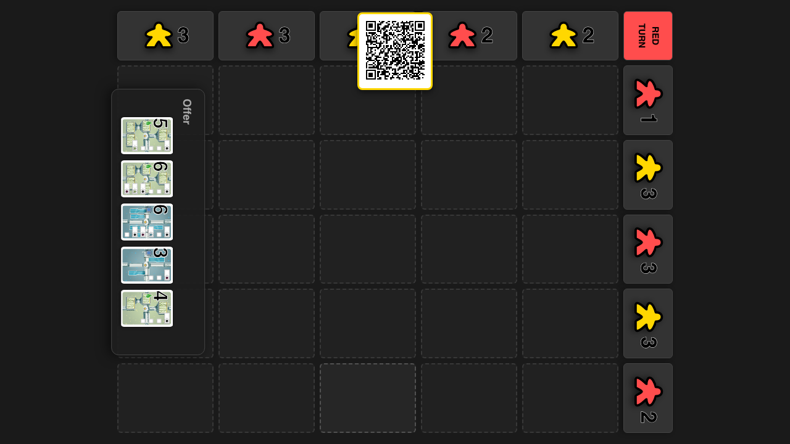
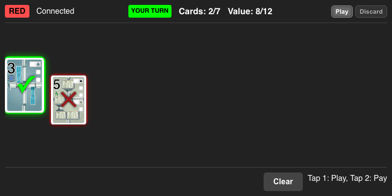
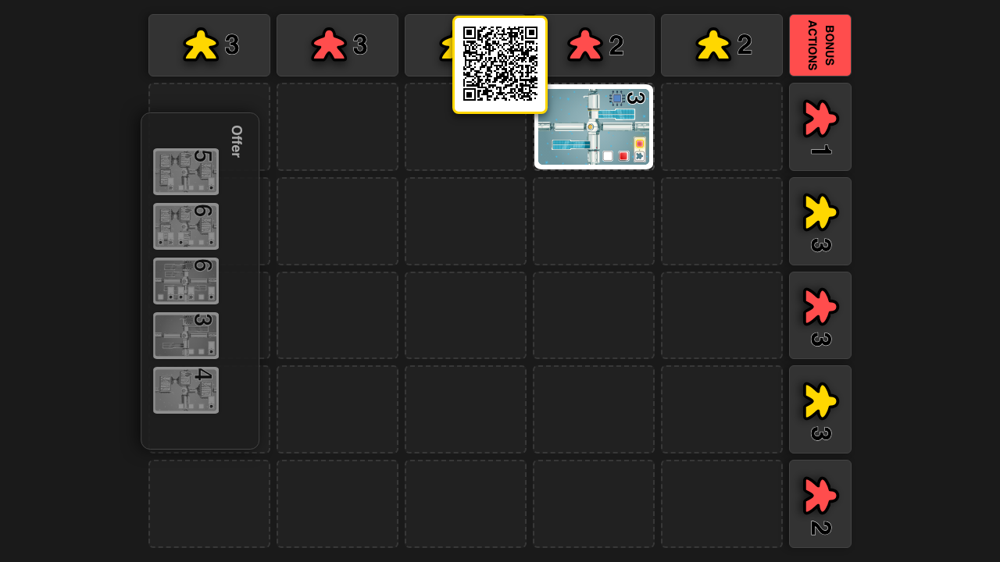

# Ownership Loop

Verify ownership updates when gaining majority in a row

## Start Game with Red and Yellow

**Specs:**
- Add Players and Start

## Connect Red Player

**Specs:**
- Open Red Client

## Red Plays Card into Row 1

**Specs:**
- Select and Play Card

## Place card in Row 1 Col 0

**Specs:**
- Click Row 1 Col 0

## Check Row 1 Ownership is Red

**Specs:**
- Row 1 Header should be Red

