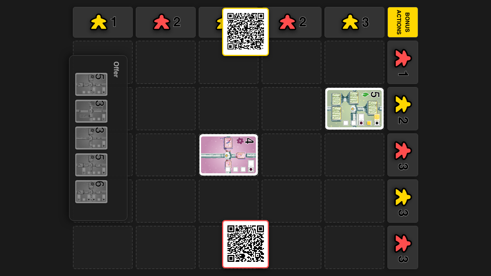
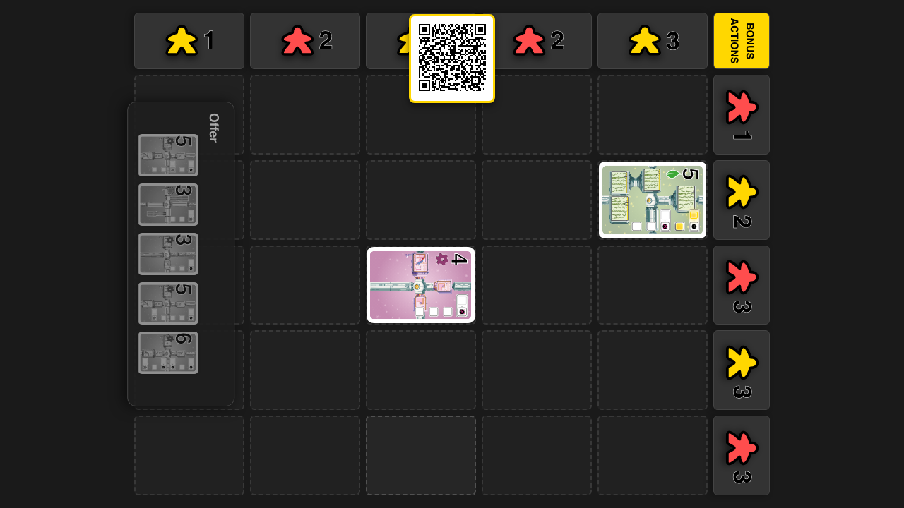
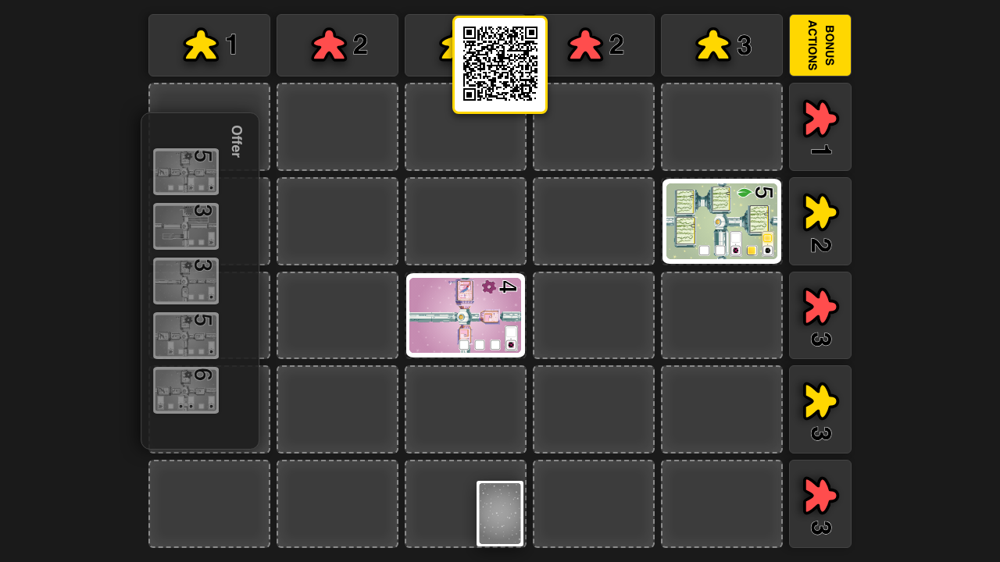
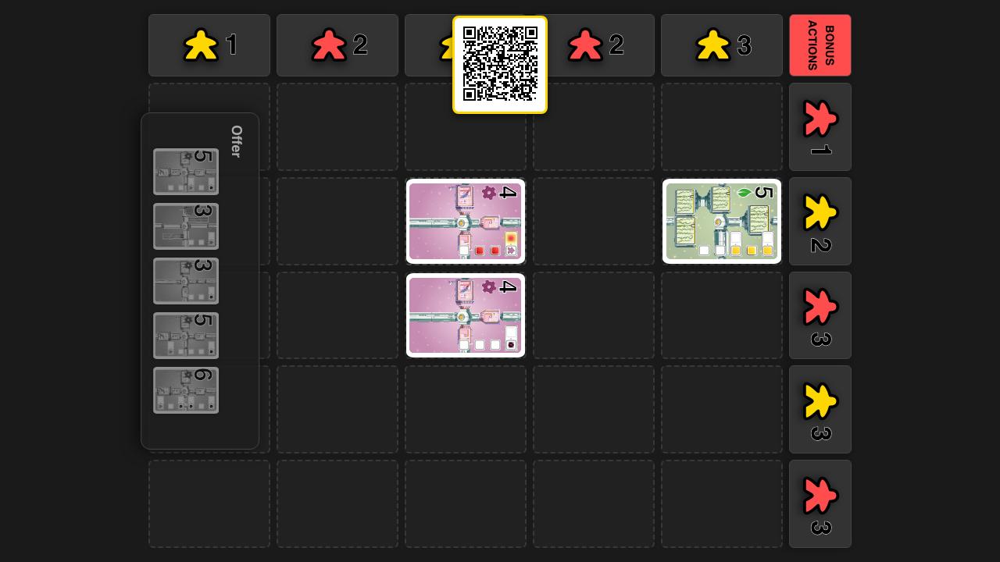

# Ownership Flip

Verify flipping ownership of Row 2 and Col 1 from Yellow to Red

## Start Game with Red and Yellow

**Specs:**
- Add Players and Start

## Script Yellow to claim Row 2 and Column 1

**Specs:**
- Execute Yellow Moves

## Connect Red Player

**Specs:**
- Open Red Client

## Ensure Red has a play generating >= 2 cubes

**Specs:**
- Cycle cards until strong pair found

## Red plays at (2, 1) intersection

**Specs:**
- Select matching/overpay pair

## Execute move at (2, 1)

**Specs:**
- Click cell (2, 1)

## Row 2 and Col 1 should be Red

**Specs:**
- Headers are Red

