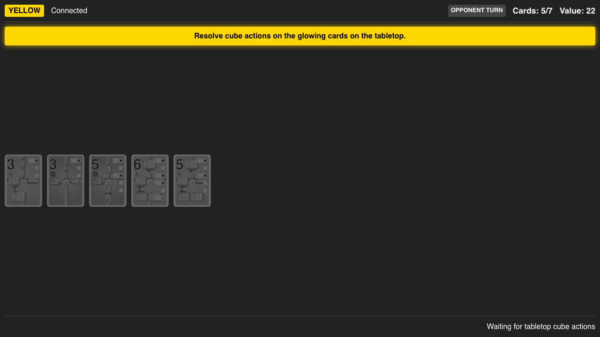
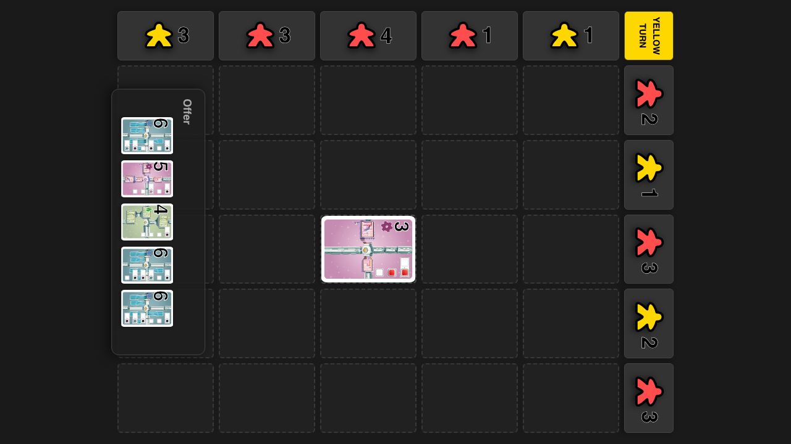

# Bonus Mechanics

**As a** player, **I want** to execute bonuses (Add Population) when triggered.

## Review: Board Loaded

**Specs:**
- Board visible

## Bonus Phase Active

**Specs:**
- Turn indicator says BONUS ACTIONS
- Interactive Bonus Cube Visible
- The card requiring attention glows
- Ordinary tabletop destinations do not glow

## Next Player Waits For Cube Actions

**Specs:**
- The private hand explains what is blocking the game
- Every private card is disabled
- The preselected move is cleared

## Turn Completed

**Specs:**
- Turn indicator says YELLOW TURN
- Bonus Phase Ended
- Completed Bonus Visible
- No card still requests attention
- The next player can select cards again

