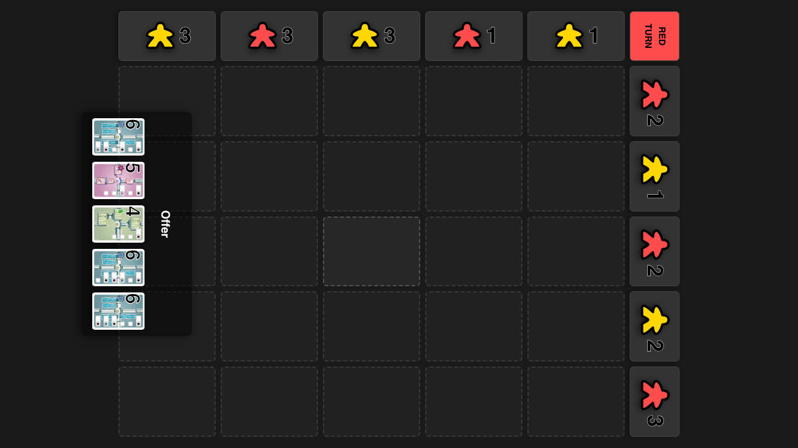
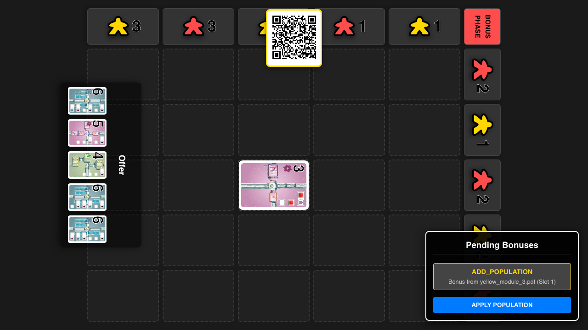
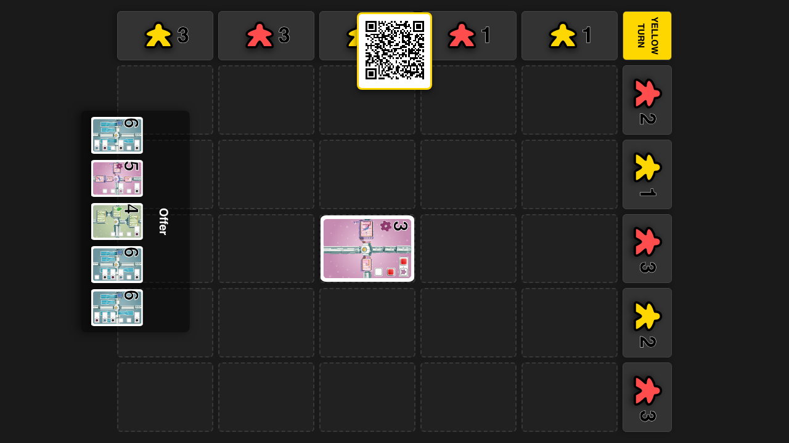

# Bonus Mechanics

**As a** player, **I want** to execute bonuses (Add Population) when triggered.

## Review: Board Loaded

**Specs:**
- Board visible

## Bonus Phase Active

**Specs:**
- Turn indicator says BONUS PHASE
- Bonus Overlay Visible
- Bonus Type is ADD_POPULATION

## Turn Completed

**Specs:**
- Turn indicator says YELLOW TURN
- Bonus Overlay Gone

