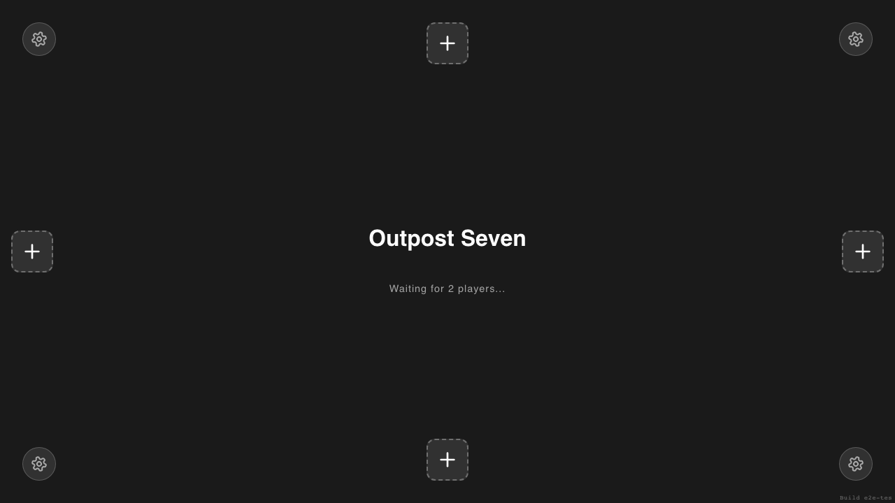
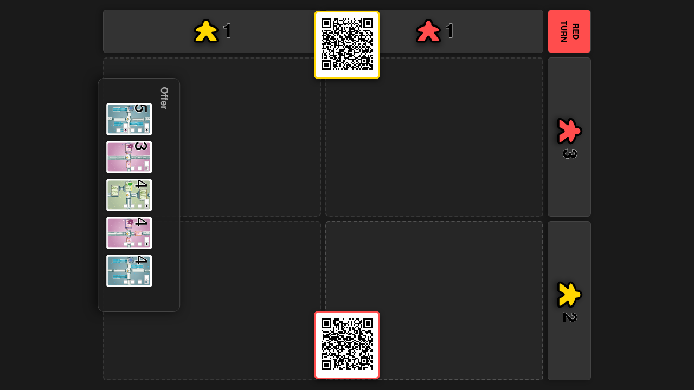
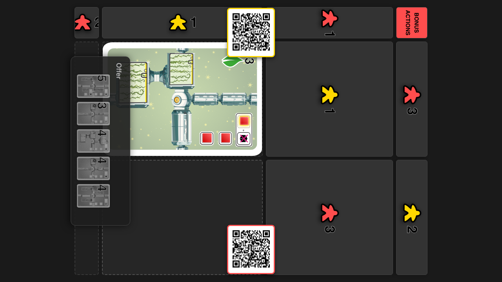
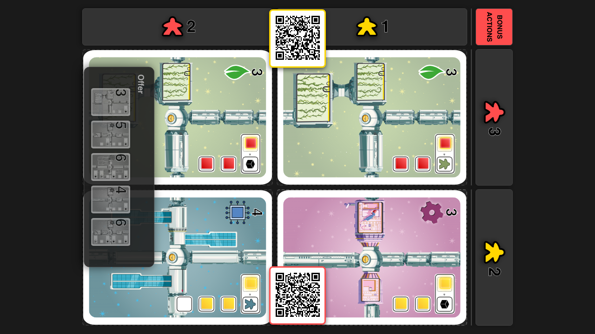
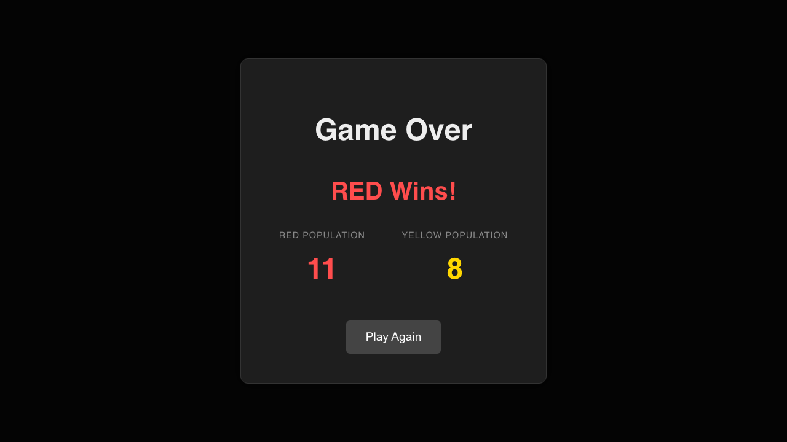

# Complete Game Loop

**As a** player, **I want** to play a complete game until a winner is declared, **so that** I can experience the full game flow.

## Game Loaded

**Specs:**
- Lobby Visible

## Settings Updated to 2x2 Grid

**Specs:**
- Grid Rows is 2

## Players Joined

**Specs:**
- Start Button Visible
- The lobby fills the viewport

## Game Started with 2x2 Grid

**Specs:**
- Board Visible
- Grid has 4 cells

## Red Played 0,0

**Specs:**

## Grid Filled

**Specs:**
- 4 played cards

## Game Over Screen

**Specs:**
- Game Over visible
