# Basic AI Match

A complete game played between two Basic AIs (Red vs Yellow).

## Initialize Game with AI Config

**Specs:**
- Load Game with Fixed Seed
- Add Players and Start

## Turn 1: RED - REPAIR (Play card_1 at 1,0)

**Specs:**
- Execute REPAIR

## Turn 2: RED - BONUS (bonus_1)

**Specs:**
- Execute RESOLVE_BONUS

## Turn 3: YELLOW - REPAIR (Play card_36 at 0,0)

**Specs:**
- Execute REPAIR

## Turn 4: YELLOW - BONUS (bonus_2)

**Specs:**
- Execute RESOLVE_BONUS

## Turn 5: RED - REPAIR (Play card_37 at 1,1)

**Specs:**
- Execute REPAIR

## Turn 6: RED - BONUS (bonus_3)

**Specs:**
- Execute RESOLVE_BONUS

## Turn 7: YELLOW - REPAIR (Play card_8 at 2,0)

**Specs:**
- Execute REPAIR

## Turn 8: YELLOW - BONUS (bonus_4)

**Specs:**
- Execute RESOLVE_BONUS

## Turn 9: YELLOW - BONUS (bonus_5)

**Specs:**
- Execute RESOLVE_BONUS

## Turn 10: RED - SALVAGE (card_2, card_22, card_11)

**Specs:**
- Execute SALVAGE

## Turn 11: YELLOW - SALVAGE (card_19, card_24)

**Specs:**
- Execute SALVAGE

## Turn 12: RED - REPAIR (Play card_2 at 1,2)

**Specs:**
- Execute REPAIR

## Turn 13: RED - BONUS (bonus_6)

**Specs:**
- Execute RESOLVE_BONUS

## Turn 14: YELLOW - REPAIR (Play card_19 at 2,2)

**Specs:**
- Execute REPAIR

## Turn 15: YELLOW - BONUS (bonus_7)

**Specs:**
- Execute RESOLVE_BONUS

## Turn 16: RED - REPAIR (Play card_22 at 0,1)

**Specs:**
- Execute REPAIR

## Turn 17: RED - BONUS (bonus_8)

**Specs:**
- Execute RESOLVE_BONUS

## Turn 18: YELLOW - SALVAGE (card_41, card_48)

**Specs:**
- Execute SALVAGE

## Turn 19: RED - SALVAGE (card_26, card_28)

**Specs:**
- Execute SALVAGE

## Turn 20: YELLOW - REPAIR (Play card_41 at 0,2)

**Specs:**
- Execute REPAIR

## Turn 21: YELLOW - BONUS (bonus_9)

**Specs:**
- Execute RESOLVE_BONUS

## Turn 22: RED - REPAIR (Play card_26 at 1,3)

**Specs:**
- Execute REPAIR

## Turn 23: RED - BONUS (bonus_10)

**Specs:**
- Execute RESOLVE_BONUS

## Turn 24: RED - BONUS (bonus_11)

**Specs:**
- Execute RESOLVE_BONUS

## Turn 25: YELLOW - SALVAGE (card_23, card_44)

**Specs:**
- Execute SALVAGE

## Turn 26: RED - SALVAGE (card_4, card_43)

**Specs:**
- Execute SALVAGE

## Turn 27: YELLOW - REPAIR (Play card_23 at 1,4)

**Specs:**
- Execute REPAIR

## Turn 28: YELLOW - BONUS (bonus_12)

**Specs:**
- Execute RESOLVE_BONUS

## Turn 29: RED - REPAIR (Play card_4 at 2,4)

**Specs:**
- Execute REPAIR

## Turn 30: RED - BONUS (bonus_13)

**Specs:**
- Execute RESOLVE_BONUS

## Turn 31: YELLOW - SALVAGE (card_18, card_12)

**Specs:**
- Execute SALVAGE

## Turn 32: RED - SALVAGE (card_40, card_13)

**Specs:**
- Execute SALVAGE

## Turn 33: YELLOW - REPAIR (Play card_18 at 2,3)

**Specs:**
- Execute REPAIR

## Turn 34: YELLOW - BONUS (bonus_14)

**Specs:**
- Execute RESOLVE_BONUS

## Turn 35: RED - REPAIR (Play card_40 at 3,0)

**Specs:**
- Execute REPAIR

## Turn 36: RED - BONUS (bonus_15)

**Specs:**
- Execute RESOLVE_BONUS

## Turn 37: YELLOW - SALVAGE (card_21, card_14)

**Specs:**
- Execute SALVAGE

## Turn 38: RED - SALVAGE (card_25, card_16)

**Specs:**
- Execute SALVAGE

## Turn 39: YELLOW - REPAIR (Play card_21 at 3,4)

**Specs:**
- Execute REPAIR

## Turn 40: YELLOW - BONUS (bonus_16)

**Specs:**
- Execute RESOLVE_BONUS

## Turn 41: RED - REPAIR (Play card_25 at 0,4)

**Specs:**
- Execute REPAIR

## Turn 42: RED - BONUS (bonus_17)

**Specs:**
- Execute RESOLVE_BONUS

## Turn 43: YELLOW - SALVAGE (card_33, card_30)

**Specs:**
- Execute SALVAGE

## Turn 44: RED - SALVAGE (card_20, card_35)

**Specs:**
- Execute SALVAGE

## Turn 45: YELLOW - REPAIR (Play card_44 at 2,1)

**Specs:**
- Execute REPAIR

## Turn 46: YELLOW - BONUS (bonus_18)

**Specs:**
- Execute RESOLVE_BONUS

## Turn 47: YELLOW - BONUS (bonus_19)

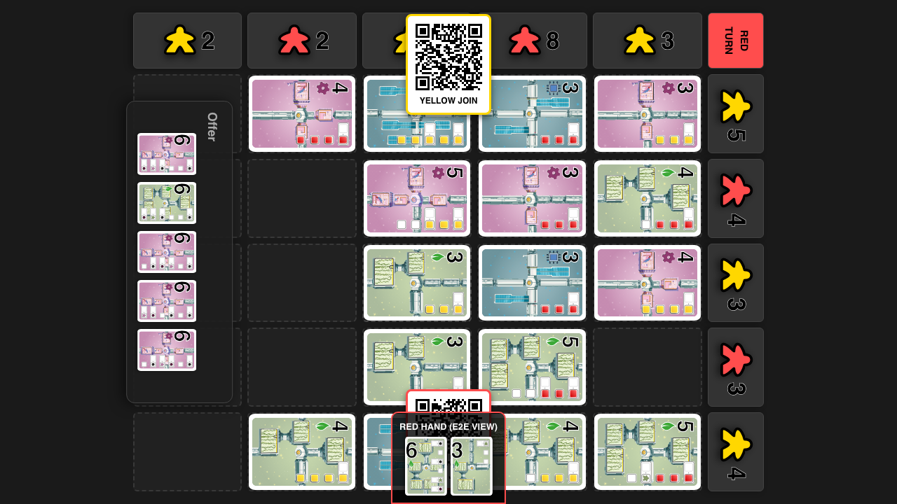

**Specs:**
- Execute RESOLVE_BONUS

## Turn 48: RED - REPAIR (Play card_20 at 3,3)

**Specs:**
- Execute REPAIR

## Turn 49: RED - BONUS (bonus_20)

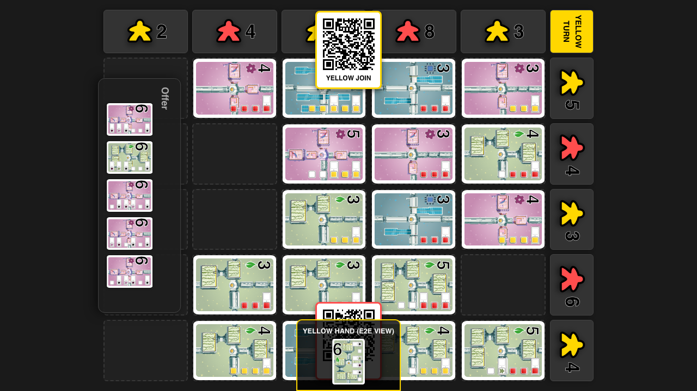

**Specs:**
- Execute RESOLVE_BONUS

## Turn 50: YELLOW - SALVAGE (card_52, card_34)

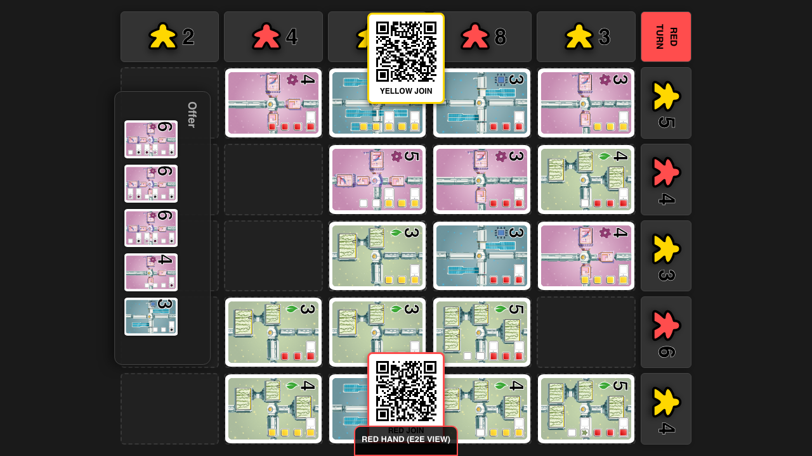

**Specs:**
- Execute SALVAGE

## Turn 51: RED - SALVAGE (card_0, card_42)

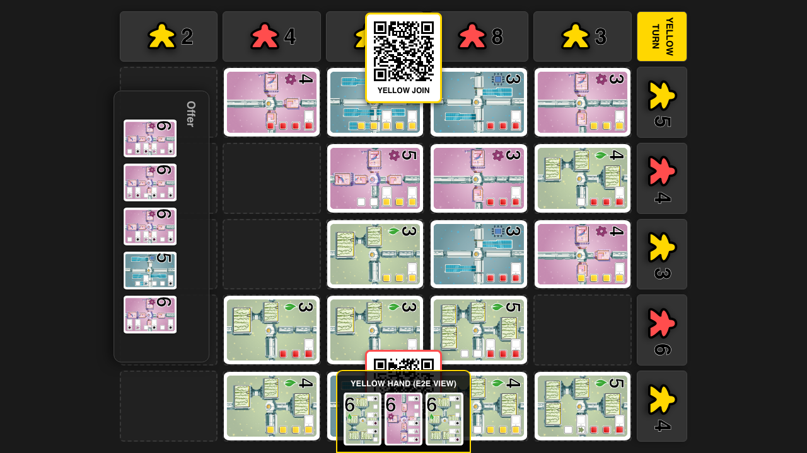

**Specs:**
- Execute SALVAGE

## Turn 52: YELLOW - REPAIR (Play card_33 at 3,1)

**Specs:**
- Execute REPAIR

## Turn 53: YELLOW - BONUS (bonus_21)

**Specs:**
- Execute RESOLVE_BONUS

## Turn 54: YELLOW - BONUS (bonus_22)

**Specs:**
- Execute RESOLVE_BONUS

## Turn 55: RED - REPAIR (Play card_0 at 4,4)

**Specs:**
- Execute REPAIR

## Turn 56: RED - BONUS (bonus_23)

**Specs:**
- Execute RESOLVE_BONUS

## Turn 57: RED - BONUS (bonus_24)

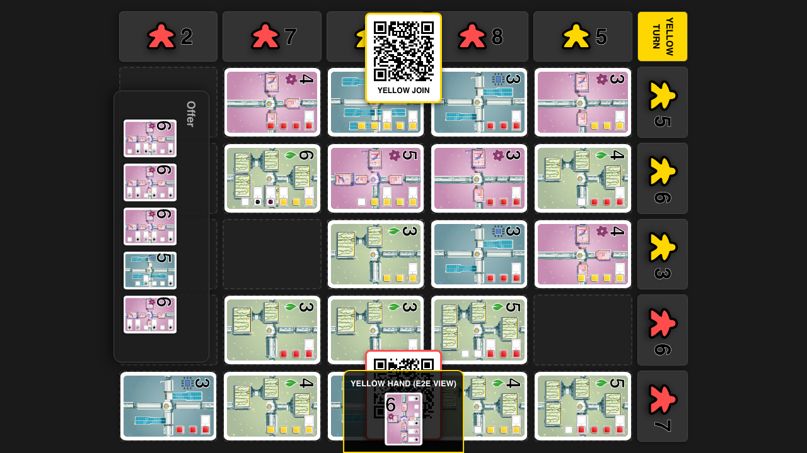

**Specs:**
- Execute RESOLVE_BONUS

## Turn 58: YELLOW - SALVAGE (card_7, card_51)

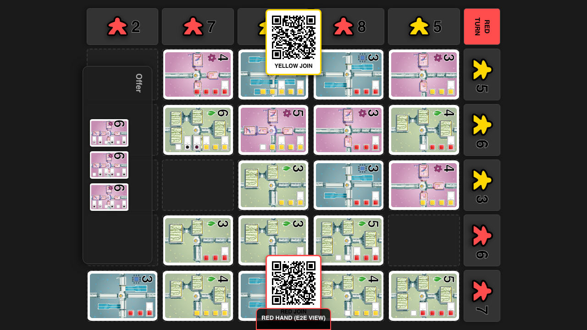

**Specs:**
- Execute SALVAGE

## Turn 59: RED - SALVAGE (card_49, card_50)

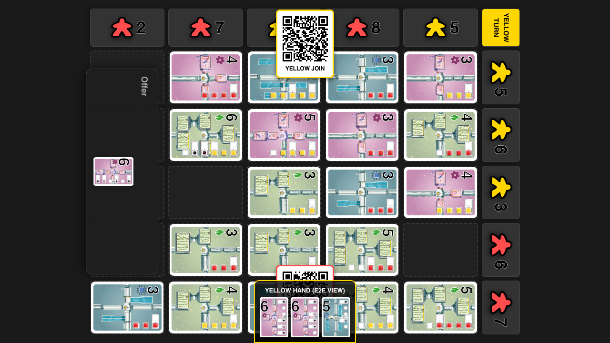

**Specs:**
- Execute SALVAGE

## Turn 60: YELLOW - REPAIR (Play card_7 at 4,1)

**Specs:**
- Execute REPAIR

## Turn 61: YELLOW - BONUS (bonus_25)

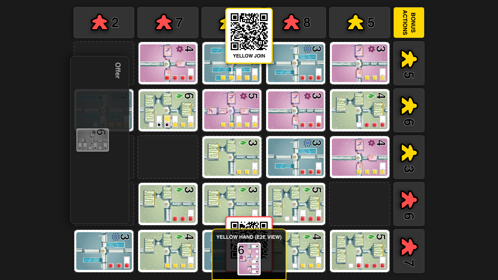

**Specs:**
- Execute RESOLVE_BONUS

## Turn 62: YELLOW - BONUS (bonus_26)

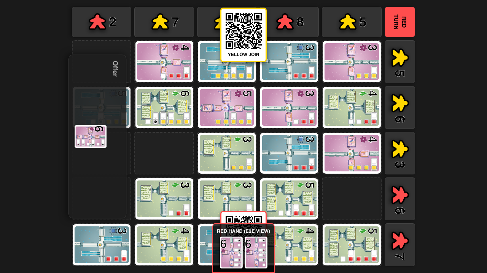

**Specs:**
- Execute RESOLVE_BONUS

## Turn 63: RED - REPAIR (Play card_50 at 4,3)

**Specs:**
- Execute REPAIR

## Turn 64: RED - BONUS (bonus_27)

**Specs:**
- Execute RESOLVE_BONUS

## Turn 65: RED - BONUS (bonus_28)

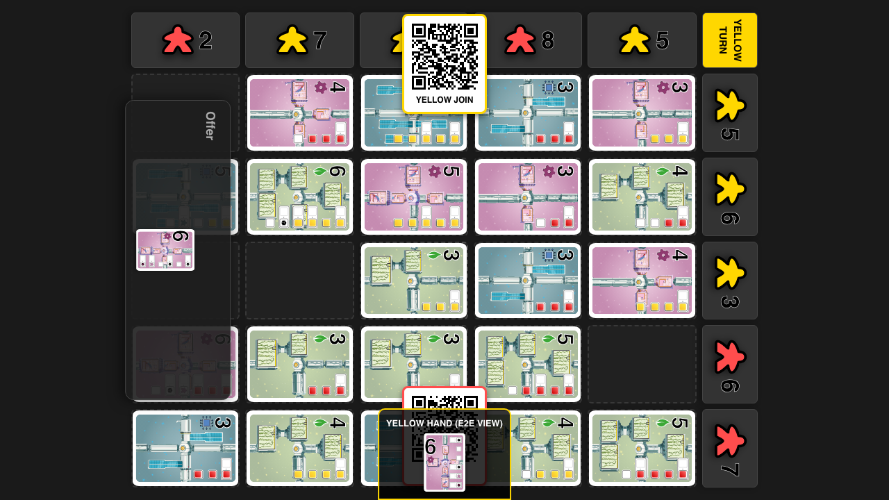

**Specs:**
- Execute RESOLVE_BONUS

## Turn 66: YELLOW - SALVAGE (card_53)

**Specs:**
- Execute SALVAGE

## Turn 67: YELLOW - REPAIR (Play card_52 at 4,2)

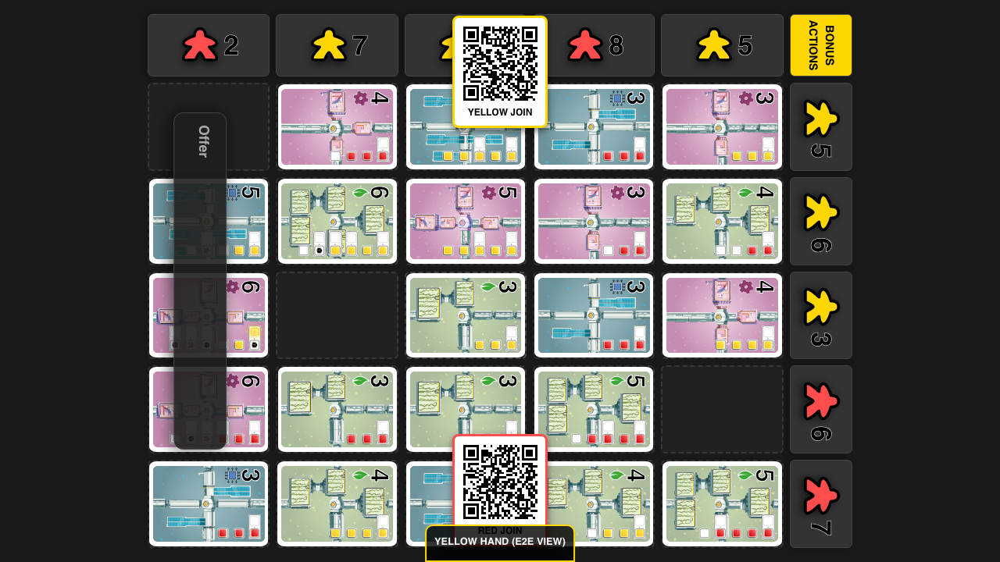

**Specs:**
- Execute REPAIR

## Turn 68: YELLOW - BONUS (bonus_29)

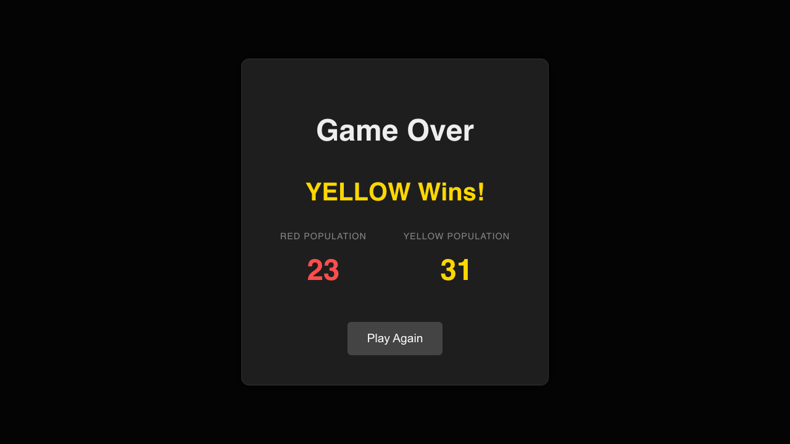

**Specs:**
- Execute RESOLVE_BONUS

## Game Over

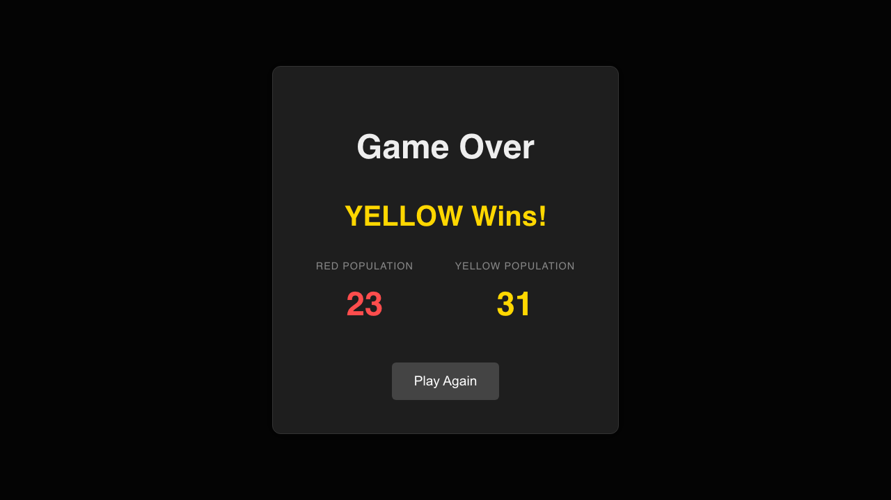

**Specs:**
- Winner Declared

