# Basic AI Match

A complete game played between two Basic AIs (Red vs Yellow).

## Initialize Game with AI Config

**Specs:**
- Load Game with Fixed Seed
- Add Players and Start

## Turn 1: RED - REPAIR (Play card_3 at 2,1)

**Specs:**
- Execute REPAIR

## Turn 2: RED - BONUS (bonus_1)

**Specs:**
- Execute RESOLVE_BONUS

## Turn 3: YELLOW - REPAIR (Play card_8 at 2,0)

**Specs:**
- Execute REPAIR

## Turn 4: YELLOW - BONUS (bonus_2)

**Specs:**
- Execute RESOLVE_BONUS

## Turn 5: YELLOW - BONUS (bonus_3)

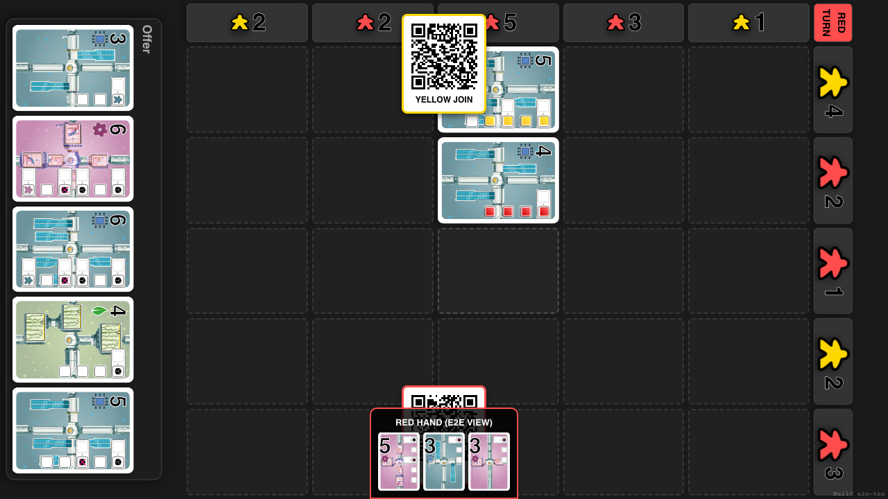

**Specs:**
- Execute RESOLVE_BONUS

## Turn 6: RED - REPAIR (Play card_1 at 2,2)

**Specs:**
- Execute REPAIR

## Turn 7: RED - BONUS (bonus_4)

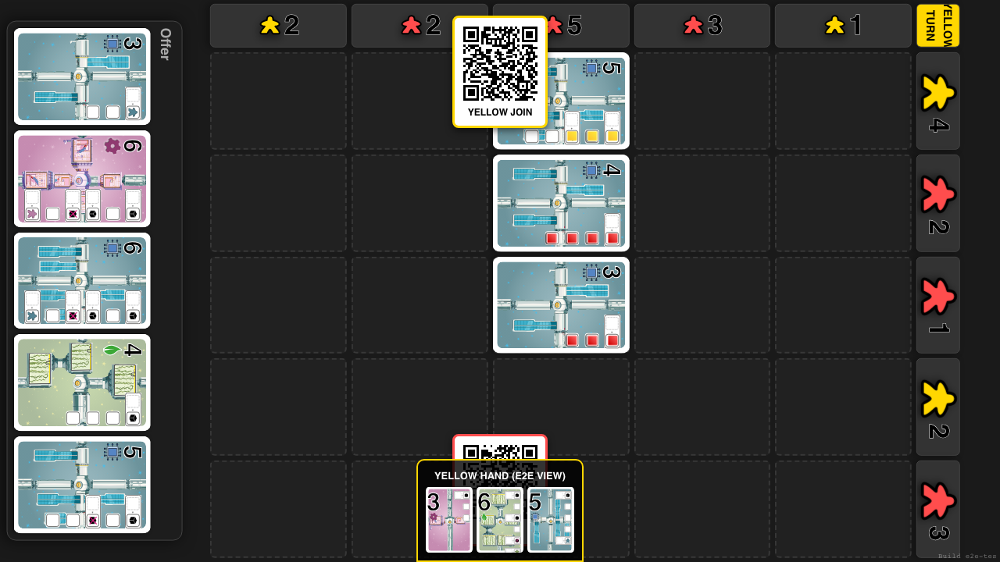

**Specs:**
- Execute RESOLVE_BONUS

## Turn 8: YELLOW - REPAIR (Play card_36 at 1,0)

**Specs:**
- Execute REPAIR

## Turn 9: YELLOW - BONUS (bonus_5)

**Specs:**
- Execute RESOLVE_BONUS

## Turn 10: RED - SALVAGE (card_2, card_22, card_11)

**Specs:**
- Execute SALVAGE

## Turn 11: YELLOW - SALVAGE (card_24, card_13)

**Specs:**
- Execute SALVAGE

## Turn 12: RED - REPAIR (Play card_37 at 2,3)

**Specs:**
- Execute REPAIR

## Turn 13: RED - BONUS (bonus_6)

**Specs:**
- Execute RESOLVE_BONUS

## Turn 14: YELLOW - REPAIR (Play card_24 at 2,4)

**Specs:**
- Execute REPAIR

## Turn 15: YELLOW - BONUS (bonus_7)

**Specs:**
- Execute RESOLVE_BONUS

## Turn 16: RED - REPAIR (Play card_2 at 0,0)

**Specs:**
- Execute REPAIR

## Turn 17: RED - BONUS (bonus_8)

**Specs:**
- Execute RESOLVE_BONUS

## Turn 18: YELLOW - SALVAGE (card_48, card_41)

**Specs:**
- Execute SALVAGE

## Turn 19: RED - SALVAGE (card_19, card_28)

**Specs:**
- Execute SALVAGE

## Turn 20: YELLOW - REPAIR (Play card_41 at 0,1)

**Specs:**
- Execute REPAIR

## Turn 21: YELLOW - BONUS (bonus_9)

**Specs:**
- Execute RESOLVE_BONUS

## Turn 22: RED - REPAIR (Play card_19 at 1,1)

**Specs:**
- Execute REPAIR

## Turn 23: RED - BONUS (bonus_10)

**Specs:**
- Execute RESOLVE_BONUS

## Turn 24: YELLOW - SALVAGE (card_26, card_23)

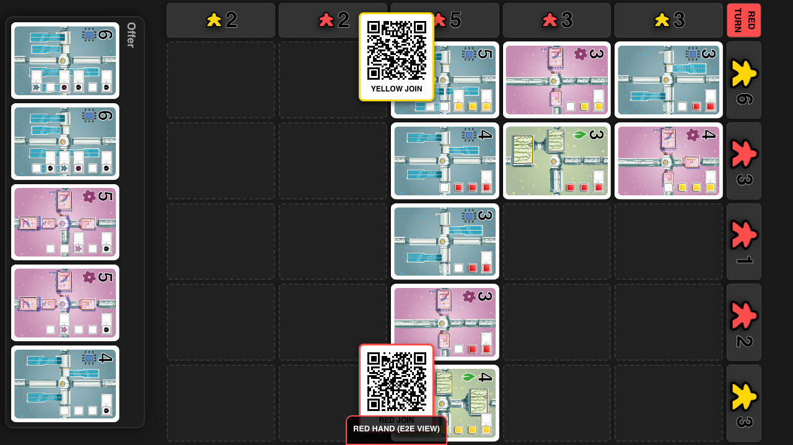

**Specs:**
- Execute SALVAGE

## Turn 25: RED - SALVAGE (card_12, card_4)

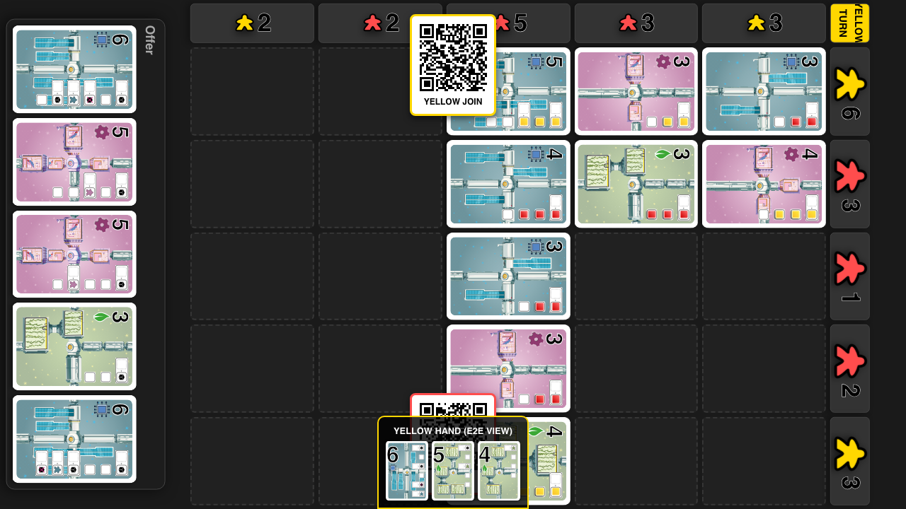

**Specs:**
- Execute SALVAGE

## Turn 26: YELLOW - REPAIR (Play card_23 at 3,0)

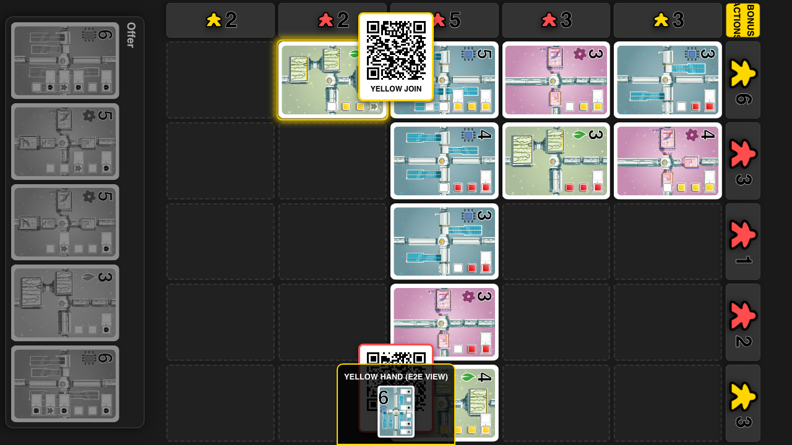

**Specs:**
- Execute REPAIR

## Turn 27: YELLOW - BONUS (bonus_11)

**Specs:**
- Execute RESOLVE_BONUS

## Turn 28: RED - REPAIR (Play card_4 at 3,4)

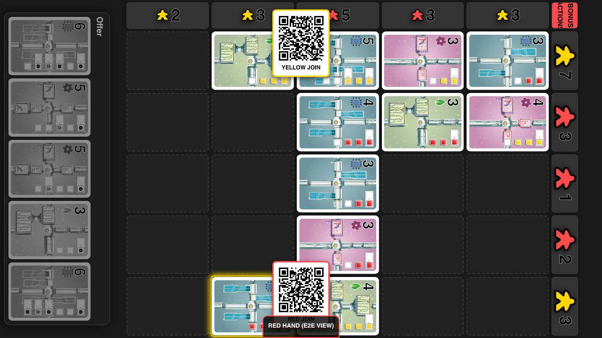

**Specs:**
- Execute REPAIR

## Turn 29: RED - BONUS (bonus_12)

**Specs:**
- Execute RESOLVE_BONUS

## Turn 30: YELLOW - SALVAGE (card_44, card_18)

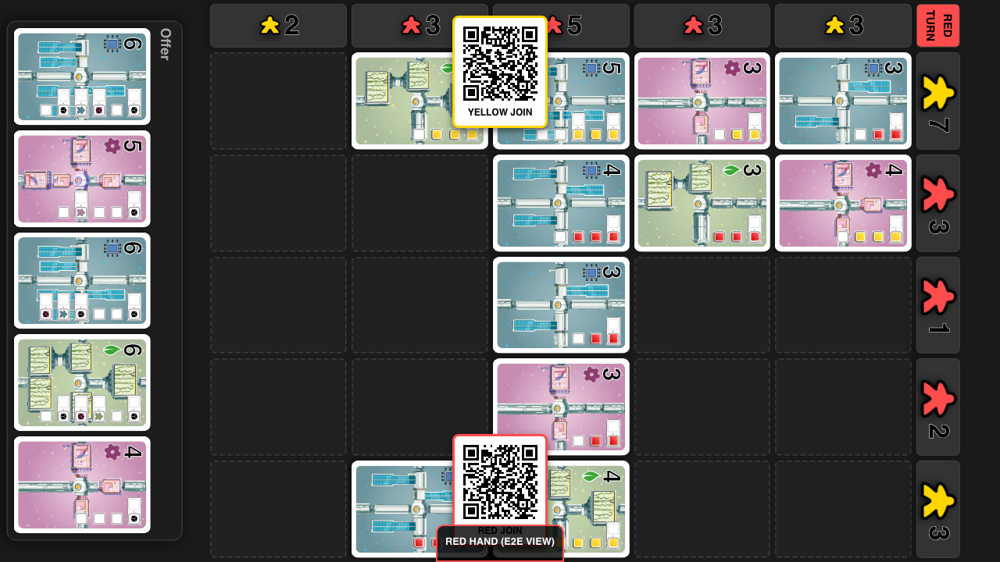

**Specs:**
- Execute SALVAGE

## Turn 31: RED - SALVAGE (card_43, card_40)

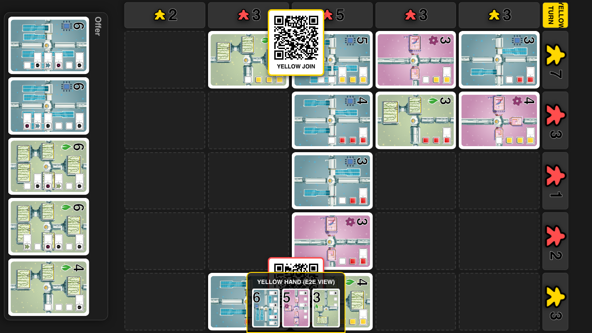

**Specs:**
- Execute SALVAGE

## Turn 32: YELLOW - REPAIR (Play card_18 at 3,3)

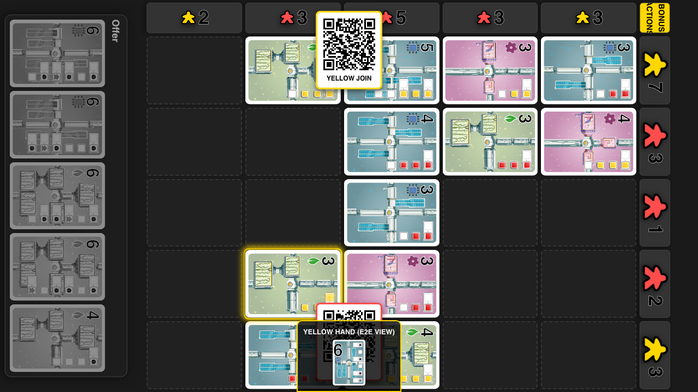

**Specs:**
- Execute REPAIR

## Turn 33: YELLOW - BONUS (bonus_13)

**Specs:**
- Execute RESOLVE_BONUS

## Turn 34: RED - REPAIR (Play card_40 at 4,4)

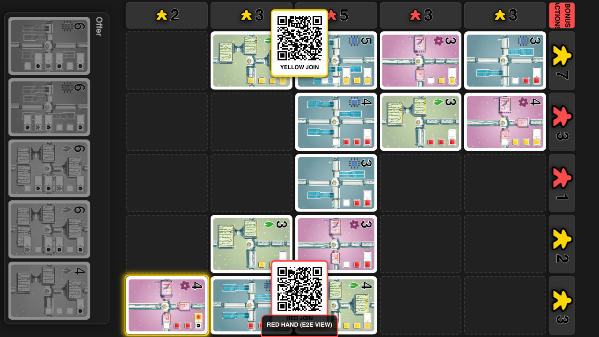

**Specs:**
- Execute REPAIR

## Turn 35: RED - BONUS (bonus_14)

**Specs:**
- Execute RESOLVE_BONUS

## Turn 36: YELLOW - SALVAGE (card_33, card_21)

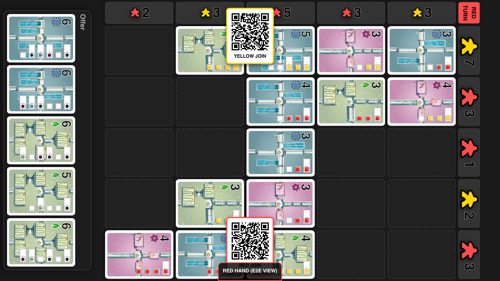

**Specs:**
- Execute SALVAGE

## Turn 37: RED - SALVAGE (card_30, card_25)

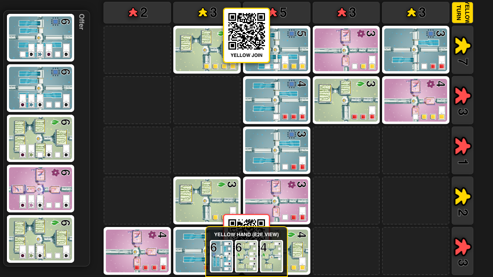

**Specs:**
- Execute SALVAGE

## Turn 38: YELLOW - REPAIR (Play card_21 at 3,1)

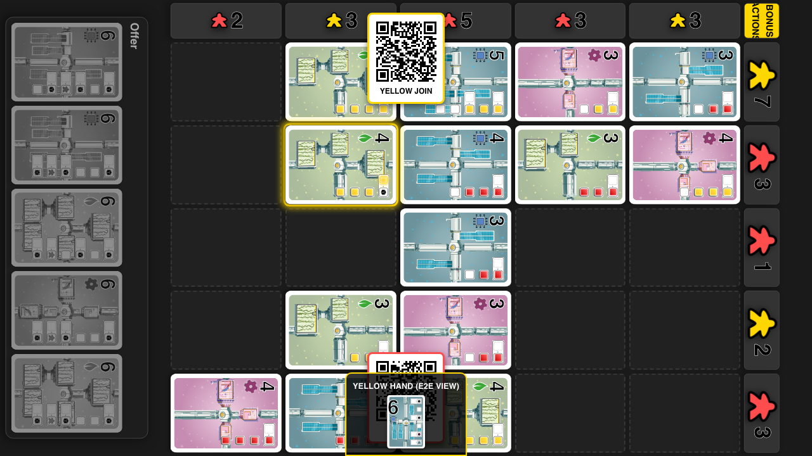

**Specs:**
- Execute REPAIR

## Turn 39: YELLOW - BONUS (bonus_15)

**Specs:**
- Execute RESOLVE_BONUS

## Turn 40: RED - REPAIR (Play card_25 at 4,1)

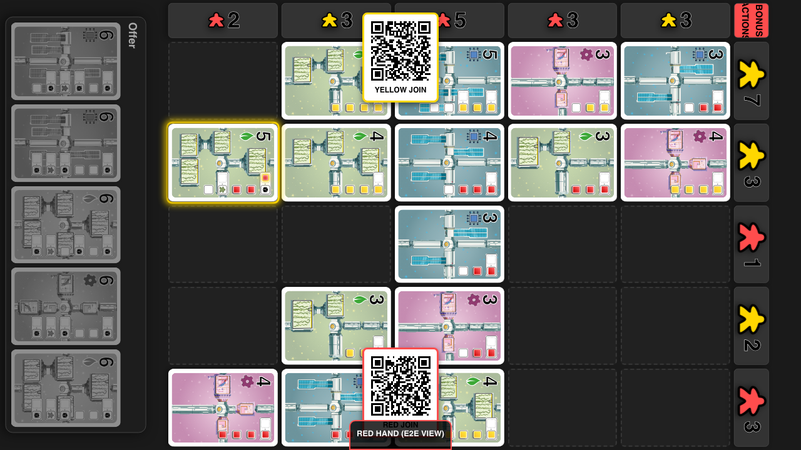

**Specs:**
- Execute REPAIR

## Turn 41: RED - BONUS (bonus_16)

**Specs:**
- Execute RESOLVE_BONUS

## Turn 42: RED - BONUS (bonus_17)

**Specs:**
- Execute RESOLVE_BONUS

## Turn 43: YELLOW - SALVAGE (card_35, card_34)

**Specs:**
- Execute SALVAGE

## Turn 44: RED - SALVAGE (card_20, card_51)

**Specs:**
- Execute SALVAGE

## Turn 45: YELLOW - REPAIR (Play card_35 at 1,3)

**Specs:**
- Execute REPAIR

## Turn 46: YELLOW - BONUS (bonus_18)

**Specs:**
- Execute RESOLVE_BONUS

## Turn 47: YELLOW - BONUS (bonus_19)

**Specs:**
- Execute RESOLVE_BONUS

## Turn 48: RED - REPAIR (Play card_20 at 0,3)

**Specs:**
- Execute REPAIR

## Turn 49: RED - BONUS (bonus_20)

**Specs:**
- Execute RESOLVE_BONUS

## Turn 50: YELLOW - SALVAGE (card_16, card_52)

**Specs:**
- Execute SALVAGE

## Turn 51: RED - SALVAGE (card_50, card_42)

**Specs:**
- Execute SALVAGE

## Turn 52: YELLOW - REPAIR (Play card_13 at 4,3)

**Specs:**
- Execute REPAIR

## Turn 53: YELLOW - BONUS (bonus_21)

**Specs:**
- Execute RESOLVE_BONUS

## Turn 54: YELLOW - BONUS (bonus_22)

**Specs:**
- Execute RESOLVE_BONUS

## Turn 55: YELLOW - BONUS (bonus_23)

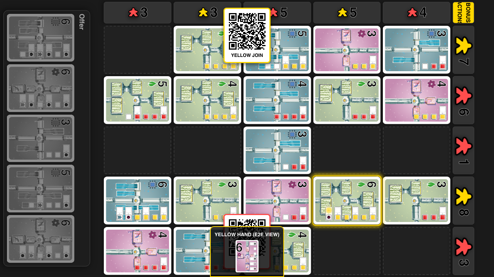

**Specs:**
- Execute RESOLVE_BONUS

## Turn 56: YELLOW - BONUS (bonus_24)

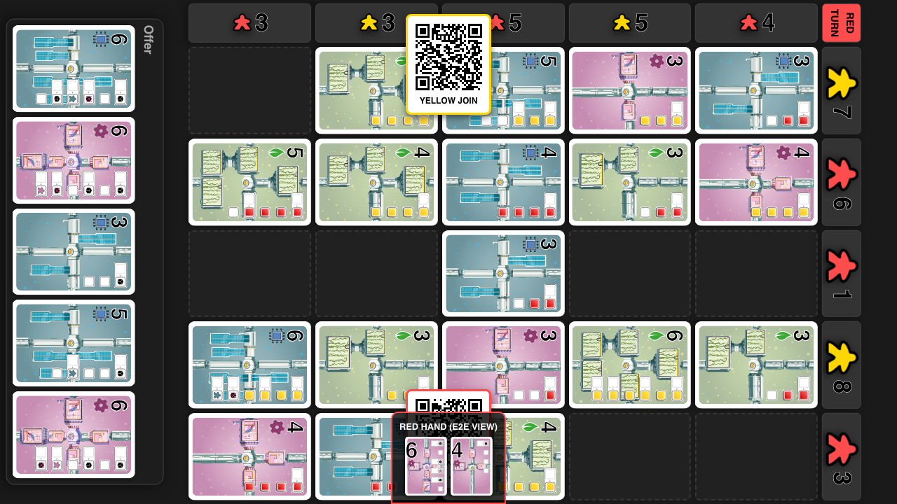

**Specs:**
- Execute RESOLVE_BONUS

## Turn 57: RED - REPAIR (Play card_42 at 4,0)

**Specs:**
- Execute REPAIR

## Turn 58: RED - BONUS (bonus_25)

**Specs:**
- Execute RESOLVE_BONUS

## Turn 59: YELLOW - SALVAGE (card_0, card_7)

**Specs:**
- Execute SALVAGE

## Turn 60: RED - SALVAGE (card_49, card_53)

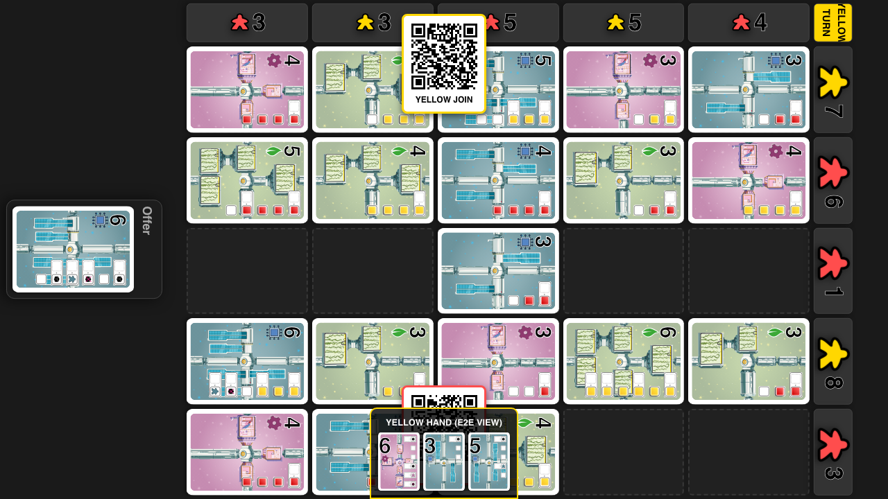

**Specs:**
- Execute SALVAGE

## Turn 61: YELLOW - REPAIR (Play card_0 at 0,4)

**Specs:**
- Execute REPAIR

## Turn 62: YELLOW - BONUS (bonus_26)

**Specs:**
- Execute RESOLVE_BONUS

## Turn 63: RED - REPAIR (Play card_53 at 1,4)

**Specs:**
- Execute REPAIR

## Turn 64: RED - BONUS (bonus_27)

**Specs:**
- Execute RESOLVE_BONUS

## Turn 65: RED - BONUS (bonus_28)

**Specs:**
- Execute RESOLVE_BONUS

## Turn 66: YELLOW - SALVAGE (card_14)

**Specs:**
- Execute SALVAGE

## Turn 67: YELLOW - REPAIR (Play card_52 at 1,2)

**Specs:**
- Execute REPAIR

## Turn 68: YELLOW - BONUS (bonus_29)

**Specs:**
- Execute RESOLVE_BONUS

## Game Over

**Specs:**
- Winner Declared

