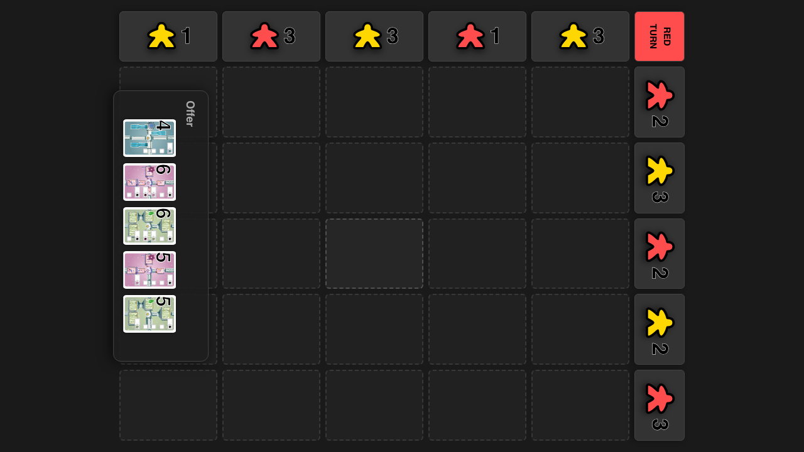
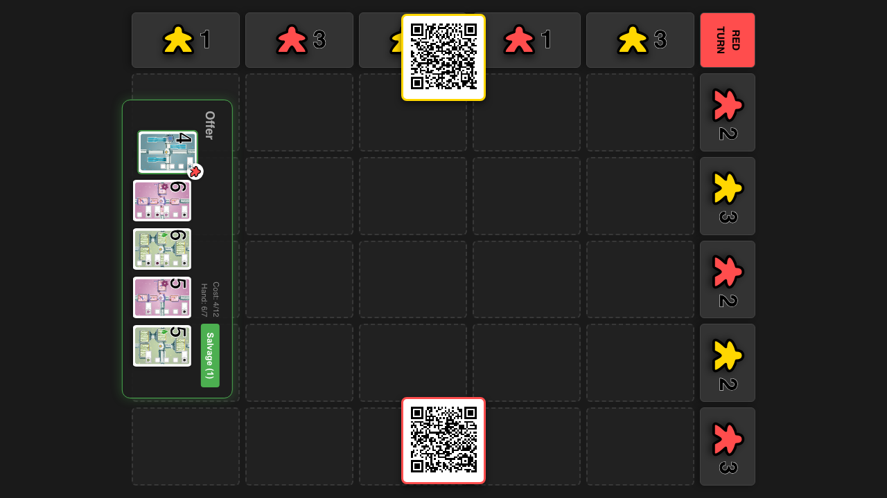
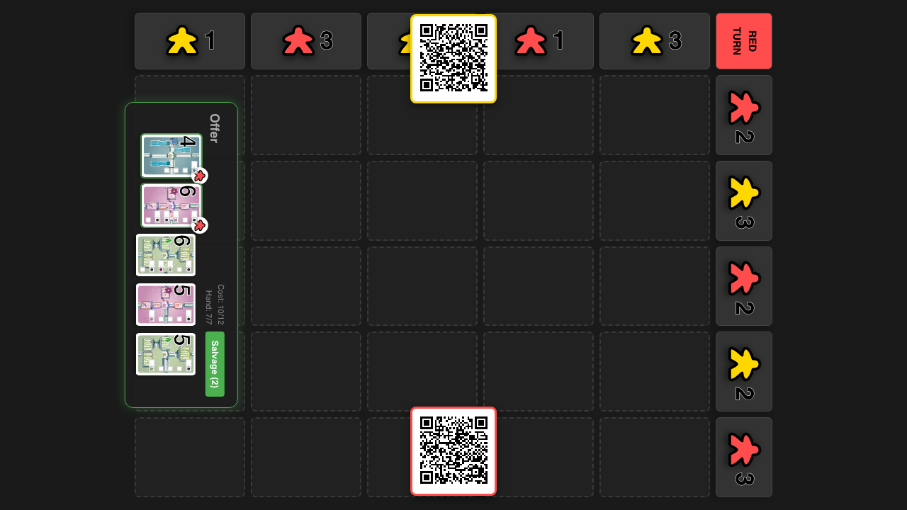
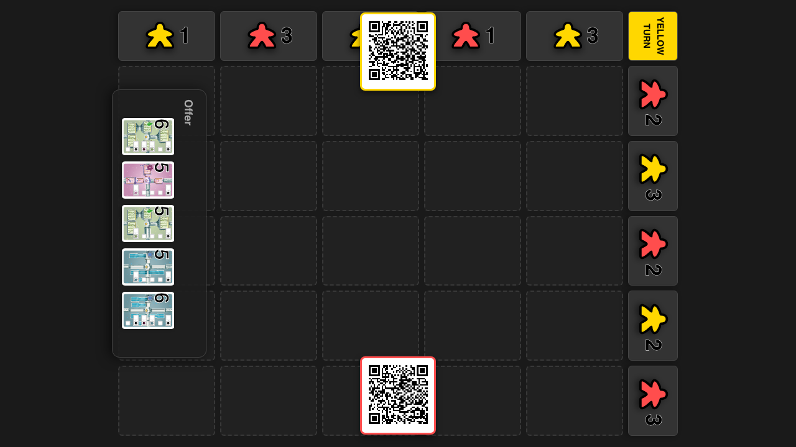

# Salvage Mechanic

**As a** player, **I want** to draft cards from the offer (up to value 12), **so that** I can build my hand without playing.

## Start Game with Red Player

**Specs:**
- Add Players and Start
- Offer is visible
- Turn Indicator shows RED

## Player selects first card from offer

**Specs:**
- Card is visually selected
- Salvage button appears

## Player selects second card from offer

**Specs:**
- Both cards selected
- Salvage button enabled

## Player confirms salvage

**Specs:**
- Turn toggles to YELLOW
- Offer refilled to 5 cards
- Selection cleared

