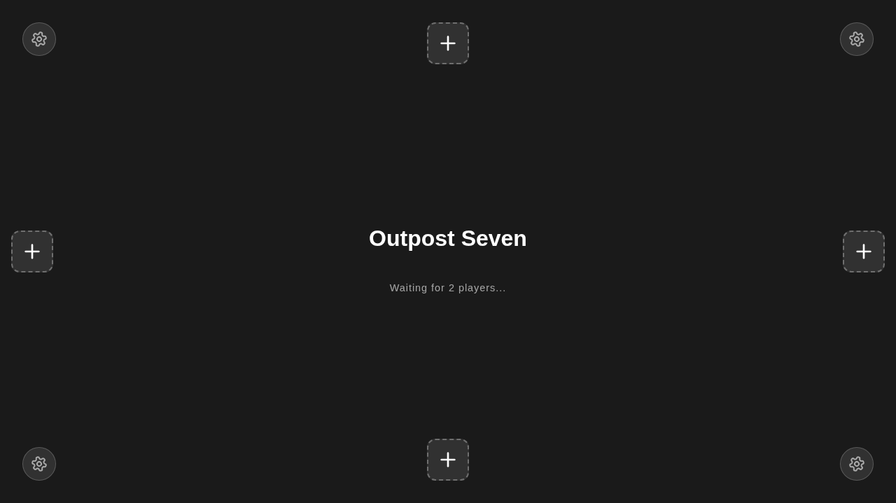
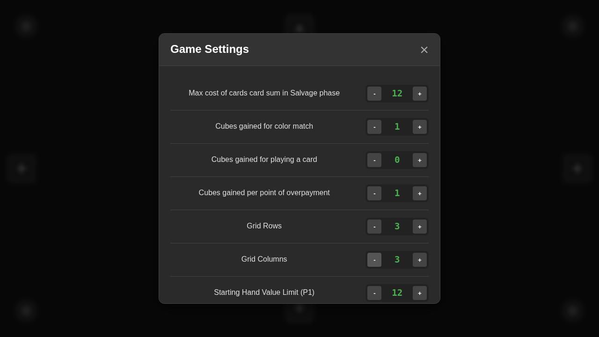
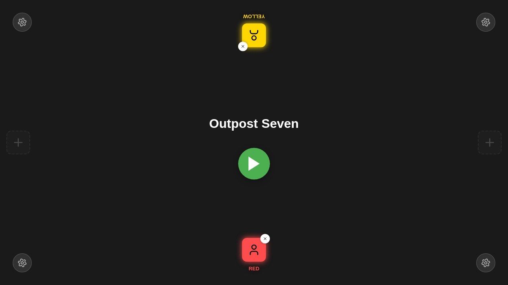
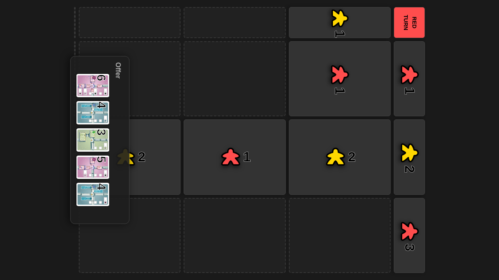
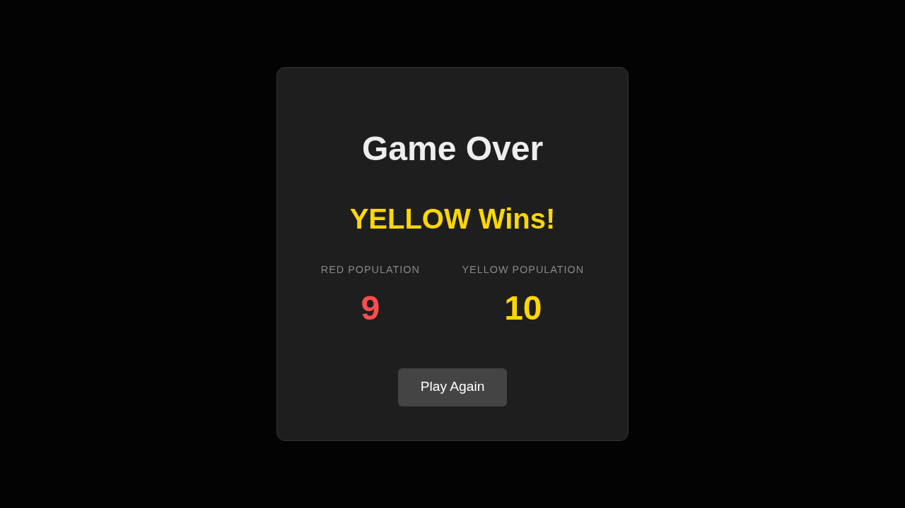

# AI vs AI Complete Game

**As a** developer, **I want** to see two AI players complete a full game, **so that** I can verify the AI logic works correctly.

## Game Loaded

**Specs:**
- Lobby Visible

## Settings Updated to 3x3 Grid

**Specs:**
- Grid Rows is 3
- Grid Cols is 3

## Both AI Players Joined

**Specs:**
- Start Button Visible

## Game Started with 3x3 Grid

**Specs:**
- Board Visible
- Grid has 9 cells

## Initial Hands (Before First Move)

Red Hand: B5, B4, G5, G5, P3 | Yellow Hand: G6, P5, P3, P4, B5

**Specs:**
- Board visible

## After 3 Moves - YELLOW's Turn

Red Hand: G5, P6, P5 | Yellow Hand: G6, P5, P3, P4, B5

**Specs:**
- Board visible

## After 6 Moves - RED's Turn

Red Hand: G5, P6, P5 | Yellow Hand: B5, B4, B6

**Specs:**
- Board visible

## After 9 Moves - YELLOW's Turn

Red Hand: G5, G3, B4, G5 | Yellow Hand: B5

**Specs:**
- Board visible

## After 12 Moves - RED's Turn

Red Hand:  | Yellow Hand: B5, P5, B6

**Specs:**
- Board visible

## After 15 Moves - RED's Turn

Red Hand: G4, P6 | Yellow Hand: P5, P3, G5, B4

**Specs:**
- Board visible

## After 18 Moves - YELLOW's Turn

Red Hand: G4, P6, B6, G6, G3, G3, G6 | Yellow Hand: P5, P3, G5, B4, B6, P6

**Specs:**
- Board visible

## Game Over Screen

**Specs:**
- Game Over Modal Visible
- Winner Declared

