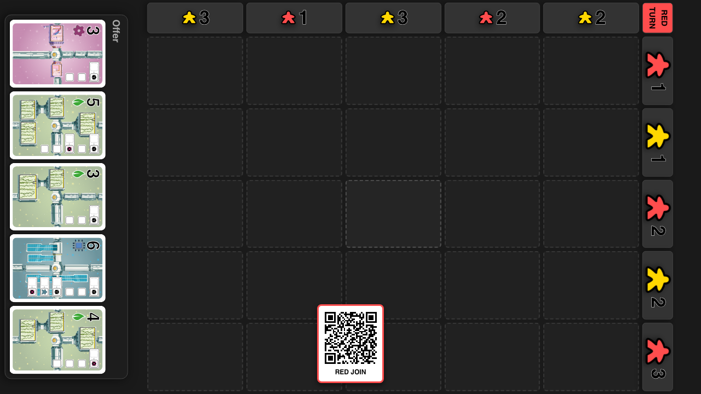
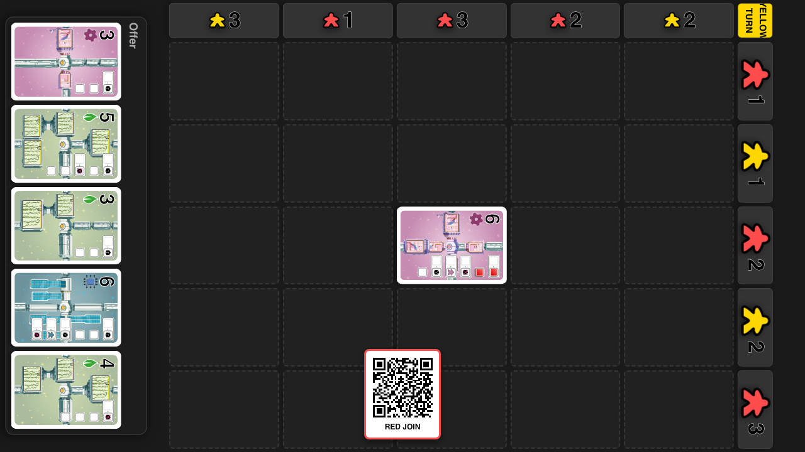

# Single Player Mode

Verify starting a solo game and AI Opponent response

## Add 1 Player and Click Start Solo

**Specs:**
- Start Game with 1 Player
- Verify AI Player Added
- Only the human player has a join QR code

## Human (Red) plays a move

**Specs:**
- Play Red Card

## Wait for AI (Yellow) to play

**Specs:**
- Wait for Turn Change or Move

