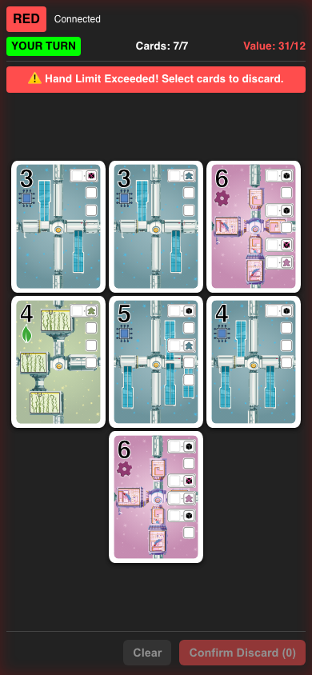
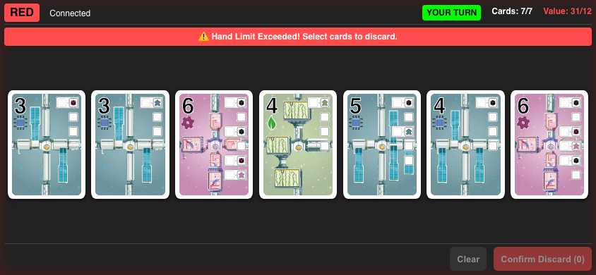
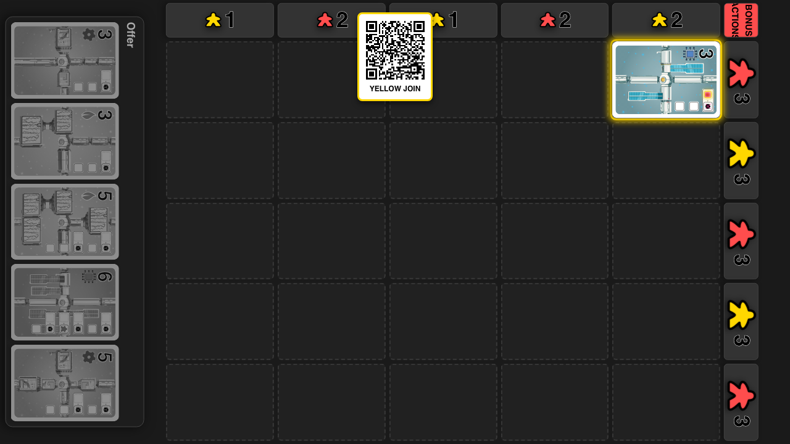

# Responsive Card Layout

Cards fill phone and tabletop displays without scrolling or resizing during movement.

## Seven-card hand fills a phone viewport

**Specs:**
- The phone page and card area have no horizontal or vertical scrolling
- Every card is fully visible and at least 100 CSS pixels wide

## Seven-card hand fills a landscape phone viewport

**Specs:**
- The landscape phone page and card area have no scrolling
- All seven cards remain fully visible and at least 100 CSS pixels wide

## Tabletop, offer, and moving cards share one large size

**Specs:**
- The placed card is at least 120 by 168 CSS pixels
- Offer cards exactly match placed board cards
- The tabletop remains contained within the display
