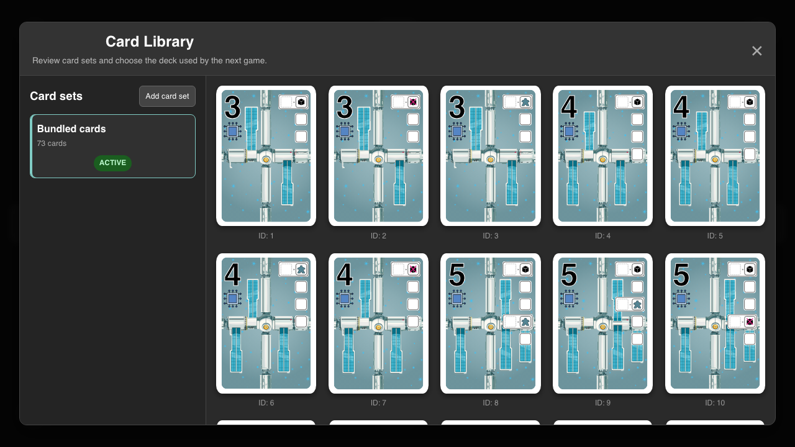
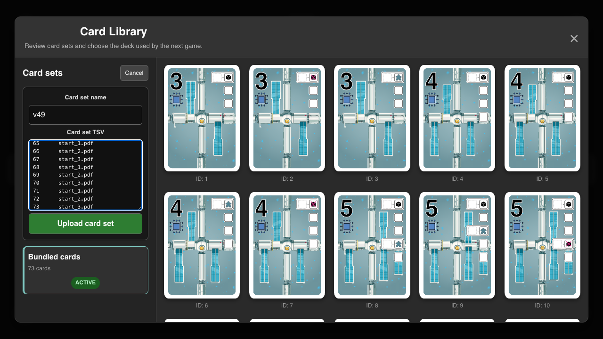
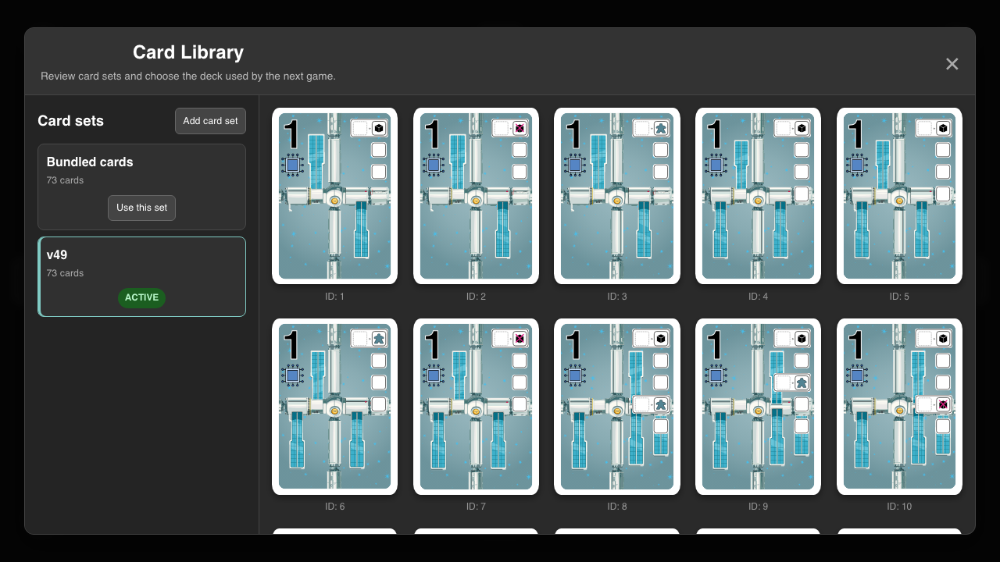
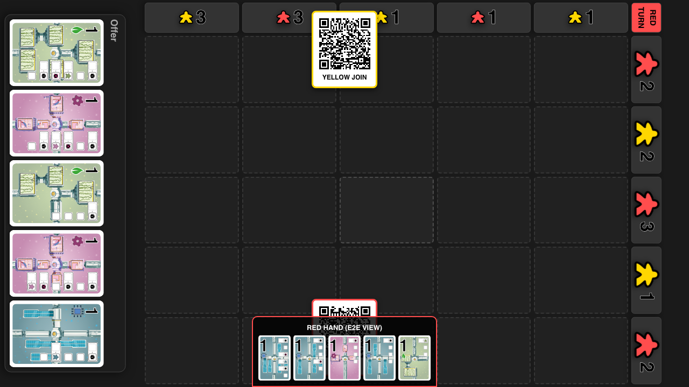

# Persistent Card Set Library

Upload a named TSV card set to Firebase, review it later, and choose it for the next game.

## Review the bundled card set

**Specs:**
- The bundled set is initially active and its cards are visible

## Paste a named TSV card set

**Specs:**
- The importer accepts a name and pasted tab-separated card data

## Choose the uploaded set for play

**Specs:**
- The uploaded set is stored with its name and complete card count

## Find the selected set after reloading

**Specs:**
- Firebase retains the uploaded set and the device remembers it as active

## Start a game with the selected card set

**Specs:**
- The offer uses the uploaded v49 values instead of the bundled values
