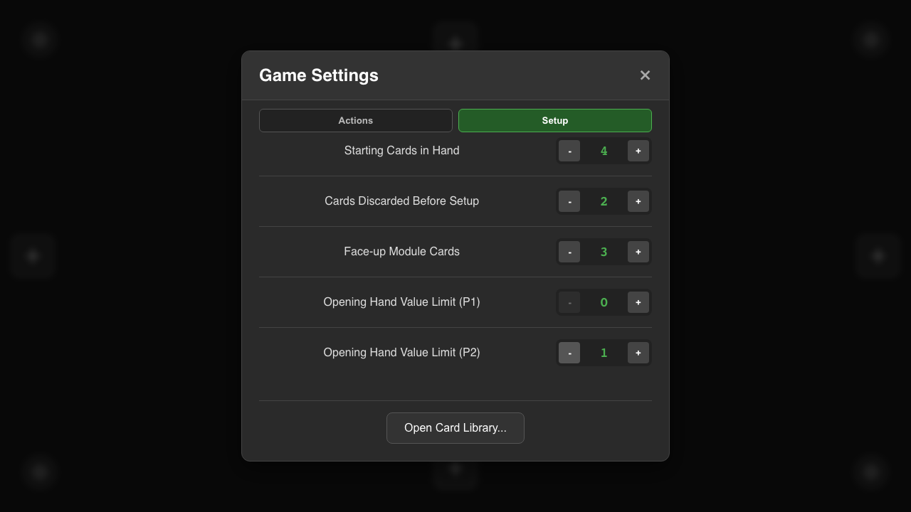
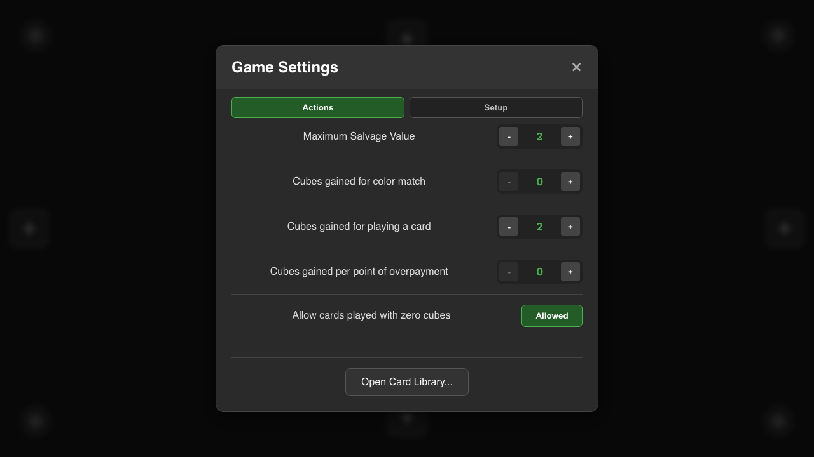
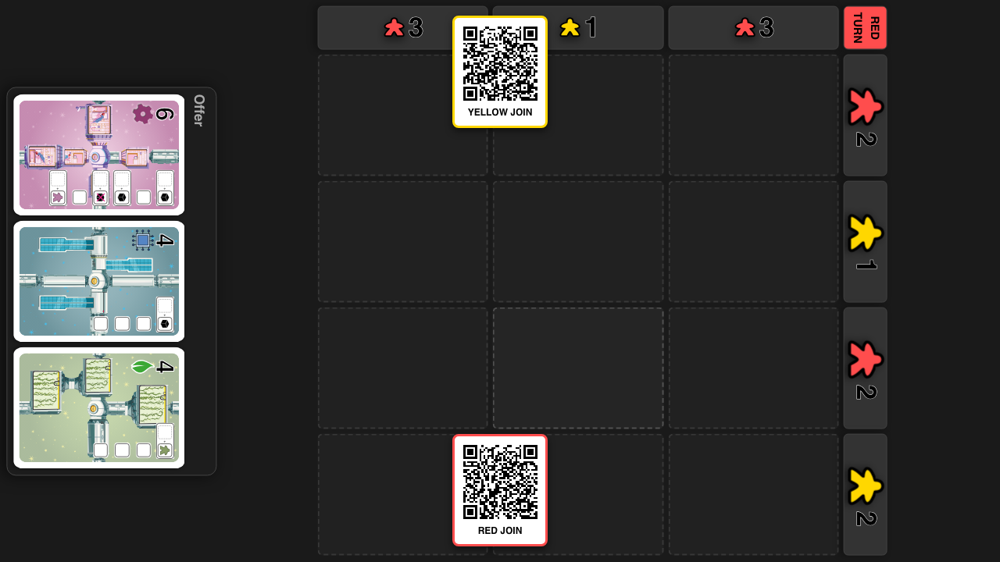
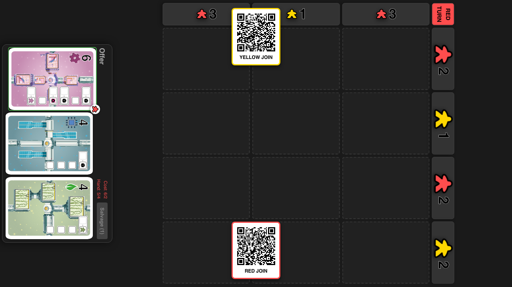
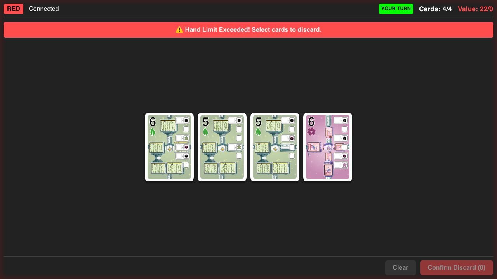

# Authoritative Game Settings

**As a** playtester, **I want** every configurable rule to follow one game settings snapshot, **so that** balance experiments behave consistently in every interface.

## Every setup constant has a visible control

**Specs:**
- All eight setup settings are represented
- GRID_ROWS is set to 3
- GRID_COLS is set to 4
- MAX_HAND_SIZE is set to 4
- STARTING_HAND_SIZE is set to 4
- BURN_CARD_COUNT is set to 2
- OFFER_SIZE is set to 3
- OPENING_HAND_VALUE_LIMIT_P1 is set to 0
- OPENING_HAND_VALUE_LIMIT_P2 is set to 1

## Every action constant has a visible control

**Specs:**
- All five action settings are represented
- SALVAGE_MAX_COST is set to 2
- CUBES_PER_COLOR_MATCH is set to 0
- CUBES_PER_PLAY is set to 2
- CUBES_PER_OVERPAYMENT is set to 0
- Zero-cube repairs can be explicitly enabled

## The game is created from the configured rules snapshot

**Specs:**
- The tabletop uses a 3 by 4 grid and a three-card offer
- Burn, offer, and both starting hands use their configured counts

## Tabletop actions use the same configured limits

**Specs:**
- Salvage displays the configured value and hand-size limits

## The private hand receives the game rules snapshot

**Specs:**
- The configured four-card hand is synchronized
- The private UI displays the configured hand and opening-value limits
