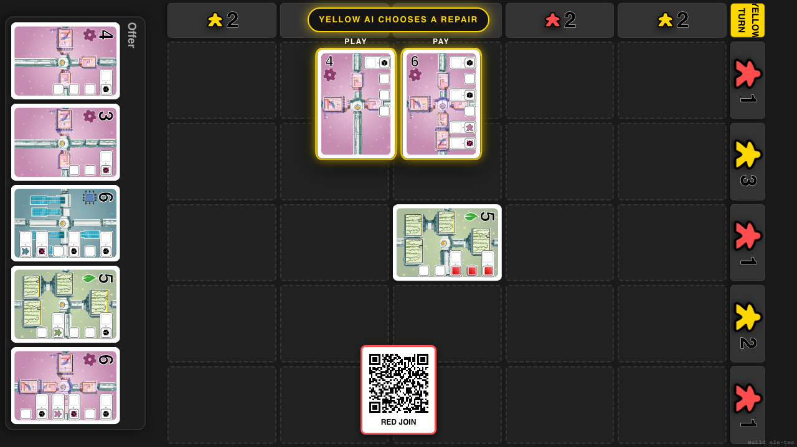
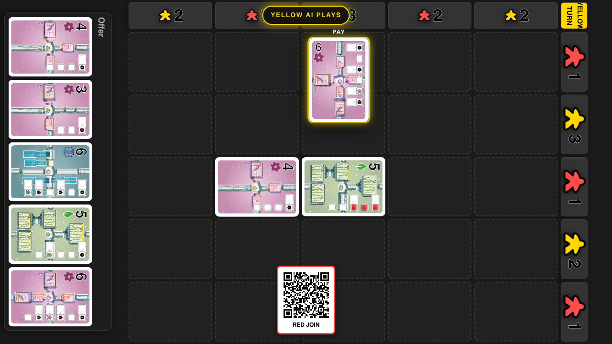
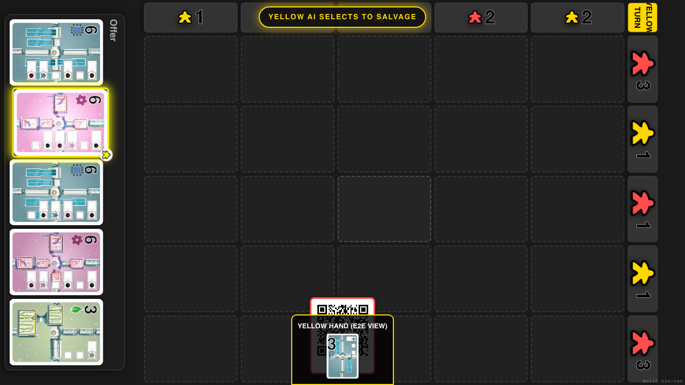
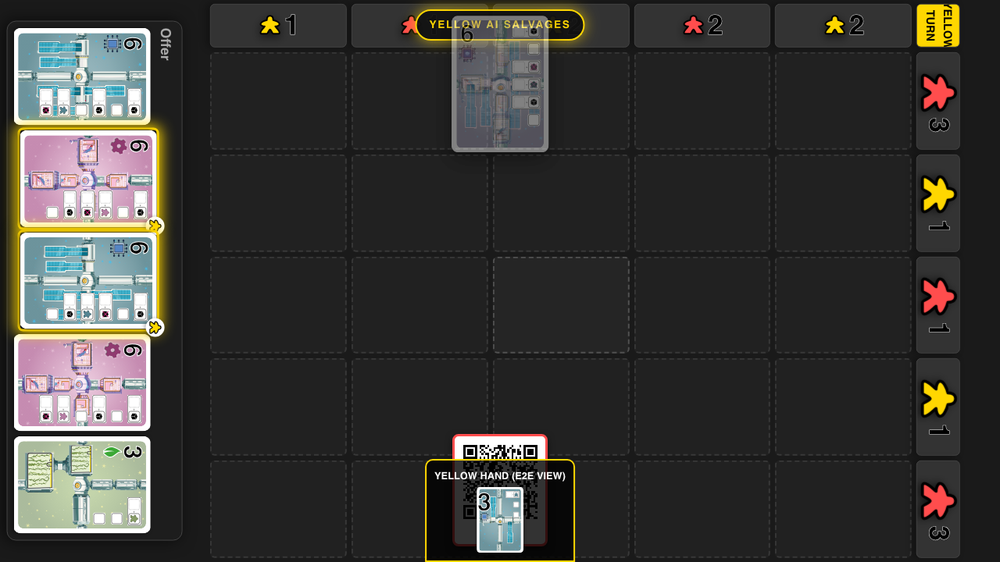

# AI Move Feedback

Slow, staged tabletop animations make the AI’s repair and salvage choices obvious to a human player.

## The AI reveals the cards chosen for its repair

**Specs:**
- The AI identifies its played and payment cards before moving

## The AI moves its played card onto the tabletop

**Specs:**
- A full-size card rotates to match the board before traveling to its cell

## The AI marks cards it selects from the offer

**Specs:**
- The currently selected offer card glows in the AI colour

## The selected offer cards travel toward the AI

**Specs:**
- Every salvaged card rotates to match the AI edge before moving there at full size
